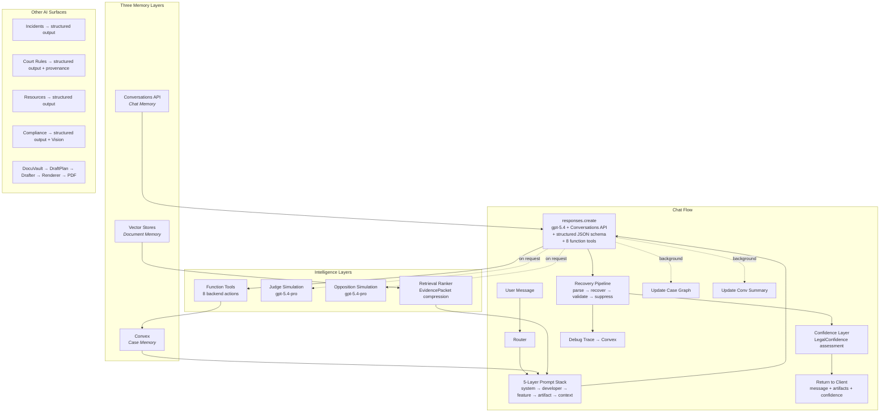

# NEXX Intelligence Stack — Full Architecture Overhaul

Migrate the entire NEXX AI surface from `chat.completions` to the **Responses API** with `gpt-5.4`, add **Conversations API** for chat continuity, replace regex parsing with **structured outputs**, add **AI-assisted drafting** to DocuVault, build **case graph + memory**, add an **artifact system** with structured recovery, and wire **debug traces** for auditability.

> [!IMPORTANT]
> Branch: `feat/responses-api-architecture`. This touches **every AI endpoint** and the orchestration layer across the app. ~44 new files, ~19 modified files. **Zero deferred items — everything ships in this phase.**

---

## What's Wrong Today — Line by Line

| Surface | File | Current | Problem |
|---------|------|---------|---------|
| **Chat** | [route.ts](file:///Users/monicafernandez/Downloads/NEX/nexx-app/src/app/api/chat/route.ts) | `chat.completions.create` + 362-line monolithic prompt | Stateless replay, no routing, no post-processing, generic output, no artifacts |
| **Incidents** | [route.ts](file:///Users/monicafernandez/Downloads/NEX/nexx-app/src/app/api/incidents/analyze/route.ts) | `chat.completions.create` + 4 regex matches (`---COURT_SUMMARY---` etc.) | Brittle, fails silently, no schema guarantee |
| **Court Rules** | [courtRulesLookup.ts](file:///Users/monicafernandez/Downloads/NEX/nexx-app/src/lib/legal/courtRulesLookup.ts) | `chat.completions.create` + `json_object` + 40-line `validateCourtFormattingRules()` | No schema enforcement, manual field whitelist |
| **Resources** | [route.ts](file:///Users/monicafernandez/Downloads/NEX/nexx-app/src/app/api/resources/lookup/route.ts) | `chat.completions.create` + `json_object` + 130 lines of sanitizers | Loose JSON, 6 manual sanitize functions |
| **Compliance** | [complianceChecker.ts](file:///Users/monicafernandez/Downloads/NEX/nexx-app/src/lib/legal/complianceChecker.ts) | `chat.completions.create` + Vision + `json_object` | No schema on report structure |
| **DocuVault** | [route.ts](file:///Users/monicafernandez/Downloads/NEX/nexx-app/src/app/api/documents/generate/route.ts) | Templates define structure, `bodyContent` is empty | No AI generates the actual legal content |
| **Chat Input** | [ChatInput.tsx](file:///Users/monicafernandez/Downloads/NEX/nexx-app/src/components/chat/ChatInput.tsx) | Text + voice only | No file attachment |
| **Messages** | [schema.ts L137-147](file:///Users/monicafernandez/Downloads/NEX/nexx-app/convex/schema.ts) | `role`, `content`, `metadata`, `requestId` | No `mode` field, no artifact storage |
| **Conversations** | [schema.ts L119-134](file:///Users/monicafernandez/Downloads/NEX/nexx-app/convex/schema.ts) | 4 modes: therapeutic/legal/strategic/general | No OpenAI conversation state, no route modes, no vector store link |
| **Conversation Modes** | [constants.ts](file:///Users/monicafernandez/Downloads/NEX/nexx-app/src/lib/constants.ts) | 4 labels: Therapeutic/Legal/Strategic/General | Doesn't map to the 8+ router modes |
| **System Prompt** | [systemPrompt.ts](file:///Users/monicafernandez/Downloads/NEX/nexx-app/src/lib/systemPrompt.ts) | Single 362-line monolithic prompt with inline context injection | Identity/behavior/tools/context all fused, no layers |
| **Tiers** | [tiers.ts](file:///Users/monicafernandez/Downloads/NEX/nexx-app/src/lib/tiers.ts) | `gpt-4o` primary, `gpt-4o-mini` fallback | No `gpt-5.4`, no tier-based model routing |
| **Rate Limits** | [rateLimit.ts](file:///Users/monicafernandez/Downloads/NEX/nexx-app/src/lib/rateLimit.ts) | `chat_message_4o` / `chat_message_mini` | Needs `chat_message_5_4` bucket |
| **Debug/Audit** | — | No trace system | No auditability for AI responses, recovery events, or artifact generation |

---

## Decisions Confirmed

| Decision | Choice |
|----------|--------|
| Model | `gpt-5.4` primary, `gpt-5.4-mini` fallback, `gpt-5.4-pro` premium deep-analysis |
| Conversations API | Yes — for chat continuity. Convex stays source of truth for domain state |
| `previous_response_id` vs Conversations | Prefer Conversations API for main chat. `previous_response_id` is lighter but more fragile |
| File upload UI | Yes — add attachment button in this PR |
| Tavily | Keep for Phase 1 legal search, wrap in `legalRetriever.ts` |
| Structured chat response | JSON schema: `{ message, artifacts: { draftReady, timelineReady, exhibitReady } }` |
| Recovery pipeline | Yes — parse → recover → validate → suppress weak artifacts |
| Debug traces | Yes — new Convex table + trace builder |
| Prompt layers | 5 layers (not 4): system → developer → feature → **artifact** → context |
| Streaming | Phase 1: non-streaming (structured JSON + recovery). Phase 2: streaming hybrid with draft→final swap |
| Output formatting | **Adaptive** — hidden framework, not rigid visible template. Modes A/B/C per complexity |
| Vector store strategy | Per-case (not per-user) for sharper retrieval isolation |

---

## Proposed Changes

### Phase 1A — Core Chat: Responses API + Conversations API + 5-Layer Prompts + Router + Artifacts + Recovery + Debug Traces

---

#### [NEW] [src/lib/openaiConversation.ts](file:///Users/monicafernandez/Downloads/NEX/nexx-app/src/lib/openaiConversation.ts)

OpenAI client + Conversations API helper:

```typescript
import OpenAI from "openai";

export const openai = new OpenAI({ apiKey: process.env.OPENAI_API_KEY! });

export async function ensureOpenAIConversation(existingConversationId?: string) {
  if (existingConversationId) return existingConversationId;
  const conversation = await openai.conversations.create();
  return conversation.id;
}
```

This replaces the current `getOpenAI()` singleton for chat. Non-chat routes keep using `getOpenAI()`.

---

#### [MODIFY] [src/lib/convexServer.ts](file:///Users/monicafernandez/Downloads/NEX/nexx-app/src/lib/convexServer.ts)

Add convenience wrappers used by the chat route wiring:

```typescript
/** Convenience: query via authenticated Convex client */
export async function convexQuery<T>(path: string, args: Record<string, unknown>): Promise<T> {
  const client = await getAuthenticatedConvexClient();
  return client.query(api[path] as any, args);
}

/** Convenience: mutation via authenticated Convex client */
export async function convexMutation<T>(path: string, args: Record<string, unknown>): Promise<T> {
  const client = await getAuthenticatedConvexClient();
  return client.mutation(api[path] as any, args);
}
```

The wiring imports `convexQuery` and `convexMutation` — these don't exist in the current `convexServer.ts` (which only exports `getConvexClient()` and `getAuthenticatedConvexClient()`).

---

#### [NEW] [src/lib/nexx/router.ts](file:///Users/monicafernandez/Downloads/NEX/nexx-app/src/lib/nexx/router.ts)

Turn classifier — runs before every chat call:
- **Input**: last user message + conversation summary + active route mode
- **Output**: `{ mode: RouteMode, toolPlan, temperature }`
- **Route modes**: `adaptive_chat` (default) | `direct_legal_answer` | `local_procedure` | `document_analysis` | `judge_lens_strategy` | `court_ready_drafting` | `pattern_analysis` | `support_grounding` | `safety_escalation`
- **Tool plan**: `{ useFileSearch, useWebSearch, useCodeInterpreter, useLocalCourtRetriever, needsClarification }`
- `needsClarification`: if true, model asks a targeted follow-up before answering (e.g. "Which order are you referring to?")
- Phase 1: regex heuristics. Phase 2: lightweight LLM classifier.

> [!IMPORTANT]
> The existing 4 conversation modes (`therapeutic`, `legal`, `strategic`, `general`) map to the broader `RouteMode` space. `adaptive_chat` is the default that auto-classifies into specific modes per turn.

---

#### [NEW] [src/lib/nexx/responseModes.ts](file:///Users/monicafernandez/Downloads/NEX/nexx-app/src/lib/nexx/responseModes.ts)

Mode-specific output skeletons injected into the developer prompt:

| Mode | Sections |
|------|----------|
| `direct_legal_answer` | Overview → What This Means → What Matters Legally → Next Steps |
| `local_procedure` | Overview → Verified Process → What Happens Next → Documents Needed → Mistakes to Avoid |
| `document_analysis` | What This Says → What Matters → Risk/Leverage Points → Strategic Use → Next Steps |
| `judge_lens_strategy` | Judge's View → Strong Facts → Weak Spots → Neutral Framing → Next Steps → Court-Ready Version |
| `court_ready_drafting` | Purpose → Structure → Draft Text → Formatting Notes → Filing Notes |
| `pattern_analysis` | Overview → Pattern → Why It Matters → Evidence to Preserve → Neutral Presentation → Next Steps |
| `support_grounding` | What Matters Now → What Not to Do → 3 Actions → Grounded Perspective |
| `safety_escalation` | Immediate Priority → Immediate Steps → Emergency Options → Documentation → Next Steps |

> [!IMPORTANT]
> **ATTENTION — Adaptive, not rigid (from your ATTENTION section):**
> These section lists are **hidden internal reasoning guides**, NOT mandatory visible output headings. The model uses them as a checklist behind the scenes but chooses the most natural surface form for this exact question:
> - **Mode A — Natural conversational**: For simple/emotional questions. Pure prose, no headings. The structure guides what gets mentioned, not how it's formatted.
> - **Mode B — Lightly structured**: For medium complexity. 1-2 headings, mostly prose.
> - **Mode C — Full structured panels**: For clearly complex legal/court-facing questions. All sections visible.
> The developer prompt must instruct: "Use the response structure as internal reasoning. Choose the surface format that best fits this question's complexity. DO NOT render rigid sections robotically."


#### 5-Layer Prompt Stack (all new)

| Layer | File | Role | Content |
|-------|------|------|---------|
| **A — System Policy** | [NEW] `src/lib/nexx/prompts/systemPrompt.ts` | `system` | ~25 lines. No fabricated citations. Jurisdiction = unknown until retrieved. Neutral. No diagnosis. Tool-use policy. |
| **B — Developer Behavior** | [NEW] `src/lib/nexx/prompts/developerPrompt.ts` | `developer` | Judge/attorney/human triple-lens. Answer-first. Anti-generic. Short prose > bullets. Dual output (plain + court-ready). Mode-adaptive formatting (hidden framework: A/B/C per complexity — per ATTENTION section). Current mode skeleton from `responseModes.ts` injected as internal guidance. Clarification policy: ask only if material, never to stall. |
| **C — Feature/Tool** | [NEW] `src/lib/nexx/prompts/featurePrompt.ts` | `developer` | When to use file search, web search, code interpreter. Judge-lens engine rules. Evidence → narrative → filing. |
| **D — Artifact** | [NEW] `src/lib/nexx/prompts/artifactPrompt.ts` | `developer` | **NEW vs my prior plan.** Instructs the model to populate `artifacts: { draftReady, timelineReady, exhibitReady, judgeSimulation, oppositionSimulation, confidence }` when work-product is warranted. Defines when to produce each artifact type, required fields, suppress-nothing-above-threshold rules. `judgeSimulation` and `oppositionSimulation` should be null unless the mode/query warrants simulation. `confidence` should always be populated. |
| **E — Dynamic Context** | [NEW] `src/lib/nexx/prompts/contextPrompt.ts` | `developer` | User profile, style profile, case graph, conversation summary, local sources, file context, NEX behavioral profile. Built every turn from Convex. |

---

#### Structured Chat Response Schema

The chat endpoint returns structured JSON — not raw text:

```typescript
const NEXX_RESPONSE_SCHEMA = {
  type: "json_schema",
  name: "nexx_assistant_response",
  schema: {
    type: "object",
    additionalProperties: false,
    properties: {
      message: { type: "string" },
      artifacts: {
        type: "object",
        additionalProperties: false,
        properties: {
          draftReady: { type: ["object", "null"] },    // Court-ready document draft
          timelineReady: { type: ["object", "null"] },  // Timeline exhibit
          exhibitReady: { type: ["object", "null"] },   // Evidence exhibit
          judgeSimulation: { type: ["object", "null"] },     // NEW — Judge perspective scoring
          oppositionSimulation: { type: ["object", "null"] }, // NEW — Opposition attack analysis
          confidence: { type: ["object", "null"] },           // NEW — LegalConfidence assessment
        },
        required: ["draftReady", "timelineReady", "exhibitReady",
                   "judgeSimulation", "oppositionSimulation", "confidence"],
      },
    },
    required: ["message", "artifacts"],
  },
};
```

This is passed via `text.format` in `responses.create` (Responses API parameter shape, not `response_format`).

---

#### [NEW] [src/lib/nexx/recovery/recoverStructuredOutput.ts](file:///Users/monicafernandez/Downloads/NEX/nexx-app/src/lib/nexx/recovery/recoverStructuredOutput.ts)

**NEW vs my prior plan.** Recovery pipeline for when structured output fails:

1. **Stage 1 — Initial Parse**: Try `JSON.parse(rawText)` + validate against schema
2. **Stage 2 — Extract JSON**: Regex for JSON within markdown fences or embedded in prose
3. **Stage 3 — Retry**: Re-call `responses.create` with repair prompt + same schema
4. **Stage 4 — Fallback**: Return `{ message: fallbackMessage, artifacts: { draftReady: null, timelineReady: null, exhibitReady: null, judgeSimulation: null, oppositionSimulation: null, confidence: null } }`

Returns `{ data, stage }` so the trace can record what happened.

**`retryConfig` shape** (used in Stage 3):
```typescript
interface RetryConfig {
  systemPrompt: string;       // Layer A
  developerPrompt: string;    // Layers B+C+D+E concatenated
  userPayload: { message: string };
  model: string;              // "gpt-5.4"
}
```

---

#### [NEW] [src/lib/nexx/recovery/validators.ts](file:///Users/monicafernandez/Downloads/NEX/nexx-app/src/lib/nexx/recovery/validators.ts)

**NEW vs my prior plan.** Validates parsed response:
- `validateAssistantResponse()`: checks `message` is non-empty string, `artifacts` has correct shape, each artifact is either null or has required fields
- Used by recovery pipeline after each parse attempt

---

#### [NEW] [src/lib/nexx/recovery/suppressWeakArtifacts.ts](file:///Users/monicafernandez/Downloads/NEX/nexx-app/src/lib/nexx/recovery/suppressWeakArtifacts.ts)

**NEW vs my prior plan.** After validation, suppress artifacts that don't meet quality threshold:
- Draft with no substantive content → null
- Timeline with <2 events → null
- Exhibit with no evidence references → null
- Judge simulation with all scores at 0 or empty arrays → null
- Opposition simulation with empty attack points → null
- Confidence with missing basis → null

Prevents the model from generating hollow artifacts just to fill the schema.

---

#### [NEW] [src/lib/nexx/validation/nexxArtifacts.ts](file:///Users/monicafernandez/Downloads/NEX/nexx-app/src/lib/nexx/validation/nexxArtifacts.ts)

**NEW vs my prior plan.** Artifact parsing utilities:
- `parseAssistantResponse()`: extracts `output_text` from Responses API response object
- Handles the `(response as any).output_text || response.output?.[0]?.content?.[0]?.text` extraction

---

#### [NEW] [src/lib/nexx/debug/buildTrace.ts](file:///Users/monicafernandez/Downloads/NEX/nexx-app/src/lib/nexx/debug/buildTrace.ts)

**NEW vs my prior plan.** Debug trace builder:

```typescript
export interface NexxTrace {
  traceId: string;
  request: {
    route: string;
    routeMode: string;
    model: string;
    temperature: number;
    conversationId: string;
    userId: string;
    userMessage: string;
  };
  generation?: {
    rawResponseText: string;
    parsedJson?: any;
    parseSuccess: boolean;
    parseError?: string;
  };
  validation?: {
    responseValid: boolean;
    draftValid: boolean;
    timelineValid: boolean;
    exhibitValid: boolean;
    judgeSimValid: boolean;
    oppositionSimValid: boolean;
    confidenceValid: boolean;
  };
  artifacts?: {
    draftReady: any;
    timelineReady: any;
    exhibitReady: any;
    judgeSimulation: any;
    oppositionSimulation: any;
    confidence: any;
  };
  recovery?: {
    used: boolean;
    stage: string;
  };
  performance?: {
    latencyMs: number;        // Total request-to-response time
    tokenUsage?: {
      promptTokens: number;
      completionTokens: number;
      totalTokens: number;
    };
    vectorStoreHits?: number;  // Number of file search hits
    localSourceHits?: number;  // Number of legal retriever hits
  };
  outcome: { success: boolean };
}

export function createEmptyTrace(request: NexxTrace['request']): NexxTrace;
```

---

#### [NEW] [src/lib/nexx/postprocess.ts](file:///Users/monicafernandez/Downloads/NEX/nexx-app/src/lib/nexx/postprocess.ts)

Post-processing on the `message` field:
- `polishLegalResponse()`: normalize whitespace, split long paragraphs, normalize headings, remove filler ("Great question!", "I'd be happy to"), ensure "next steps", clean repeated disclaimers
- `polishCourtDraft()`: strip conversational phrasing, bullets → numbered lists, ensure WHEREFORE language
- `injectConfidenceWarning(response, confidence)`: if `LegalConfidence.confidence === "low"`, append evidence-insufficiency note to message. If `"moderate"`, append softer "verify with your attorney" framing. `"high"` → no injection.

---

#### [MODIFY] [route.ts (chat)](file:///Users/monicafernandez/Downloads/NEX/nexx-app/src/app/api/chat/route.ts) — Full Rewrite

New flow per the wiring you provided:

```
1.  Parse body: userId, conversationId, message, routeMode,
    vectorStoreId, caseGraph, summary, userProfile, styleProfile,
    retrievedEvidencePacket
2.  Load conversation from Convex → get openaiConversationId
3.  ensureOpenAIConversation() → create if new
4.  Save openaiConversationId to Convex if first time
5.  Create debug trace
6.  Build context prompt from all Convex data
7.  Build tools array:
      - file_search if vectorStoreId present
      - web_search if toolPlan.useWebSearch
      - code_interpreter if toolPlan.useCodeInterpreter
      - NEXX_FUNCTION_TOOLS (all 8 backend actions from functionTools.ts)
8.  Call responses.create():
      - model: "gpt-5.4"
      - reasoning: { effort: "medium" }
      - temperature: 0.3
      - conversation: openaiConversationId
      - input: [system, developer×4, user]
      - tools: tools array from step 7
      - text.format: nexx_assistant_response schema
9.  Process function calls (if any):
      - Loop: while response contains function_call outputs:
        a. Execute each function call against Convex (via functionTools.ts handlers)
        b. Build function_call_output messages with results
        c. Re-call responses.create() with function outputs appended
        d. Record each tool run in toolRuns table
      - Exit loop when response contains text output (not function_call)
10. Extract rawText from final response
11. Run recovery pipeline: parse → recover → validate → suppress
12. Run confidence assessment: assessConfidence(parsedResponse, retrievedSources, caseGraph)
      - Attach LegalConfidence to response metadata
      - If confidence is "low", postprocessor injects evidence warning
13. Save user message to Convex (with mode)
14. Save assistant message to Convex (with mode + artifactsJson)
15. Save openaiLastResponseId to Convex
16. Save debug trace to Convex
17. persistAfterResponse() — async: compact summary + update case graph if needed
18. Return { ok, response: finalResponse, openaiConversationId }
```

> [!IMPORTANT]
> **Non-streaming design (Phase 1)**: The structured JSON response with artifacts requires the full response before parsing/recovery/validation can run. This means the client will see a loading state until the full response is assembled and polished — not a typewriter effect. This is intentional: structured work-product + recovery + artifact suppression cannot operate on partial tokens.
>
> **Phase 2 streaming hybrid**: Once structured output is stable, add `stream: true` with `[[NEXX_FINAL_REWRITE_START]]` / `[[NEXX_FINAL_REWRITE_END]]` markers. Client shows live draft in a temporary bubble, then swaps to polished final text on `response.completed`. The `streamRenderer.ts` accumulator + `useNexxStream()` hook handle the transition.

> [!NOTE]
> **Error handling**: On failure, the catch block saves the debug trace (with error info) but does NOT persist a failed assistant message to Convex. Only successful, validated responses are stored as messages. This prevents corrupt/partial data in the conversation history.

Key API parameter mapping:
- `chat.completions.create` → `responses.create`
- `messages` → `input`
- `system` role → `system` (for safety) + `developer` (for behavior/tools/artifacts/context)
- `response_format` → `text.format`
- `max_tokens` → managed by Responses API
- Add `reasoning: { effort: "medium" }` for gpt-5.4
- Add `conversation: openaiConversationId` for Conversations API

---

#### [DEPRECATE] [systemPrompt.ts](file:///Users/monicafernandez/Downloads/NEX/nexx-app/src/lib/systemPrompt.ts)

Keep file, mark deprecated, re-export from new 5-layer stack location.

---

#### [MODIFY] [tiers.ts](file:///Users/monicafernandez/Downloads/NEX/nexx-app/src/lib/tiers.ts)

- Add `gpt-5.4` as `PREMIUM_MODEL`
- Add `gpt-5.4-pro` as `DEEP_ANALYSIS_MODEL` for selected premium workflows (not every turn)
- `gpt-5.4-mini` → `FALLBACK_MODEL`
- Tier routing: executive/premium → gpt-5.4, pro → gpt-5.4 with fallback to gpt-5.4-mini, free → gpt-5.4-mini
- Add mode-dependent temperature constants:
  - `0.2–0.35` for legal analysis / procedure / drafting
  - `0.35–0.45` for communication drafting
  - `0.45–0.55` for brainstorming strategy / supportive framing
  - "Raise reasoning effort, not temperature" for harder tasks

---

#### [MODIFY] [rateLimit.ts](file:///Users/monicafernandez/Downloads/NEX/nexx-app/src/lib/rateLimit.ts)

Add `chat_message_5_4` rate limit bucket (separate from 4o/mini). Update `RateLimitFeature` union type.

---

### Phase 1B — Convex Schema + Mutations: Conversations + Messages + Memory + Debug Traces

---

#### [MODIFY] [schema.ts](file:///Users/monicafernandez/Downloads/NEX/nexx-app/convex/schema.ts)

**Conversations table** — add fields:
```typescript
conversations: defineTable({
    // ... existing fields (userId, title, mode, status, messageCount, lastMessageAt, createdAt)
    openaiConversationId: v.optional(v.string()),      // NEW — Conversations API handle
    openaiLastResponseId: v.optional(v.string()),      // NEW — for auditability/fallback
    vectorStoreId: v.optional(v.string()),             // NEW — linked file search store
    routeMode: v.optional(v.string()),                 // NEW — last active route mode
})
```

**Messages table** — add field:
```typescript
messages: defineTable({
    // ... existing fields
    mode: v.optional(v.string()),                      // NEW — route mode when sent
    artifactsJson: v.optional(v.string()),             // NEW — serialized artifacts
})
```

**New tables:**
```typescript
// Conversation summaries (compacted memory)
conversationSummaries: defineTable({
    conversationId: v.id('conversations'),
    summary: v.string(),        // JSON of CompactedSummary
    turnCount: v.number(),
    updatedAt: v.number(),
}).index('by_conversationId', ['conversationId']),

// Case graphs (structured case intelligence)
caseGraphs: defineTable({
    userId: v.id('users'),
    graphJson: v.string(),      // JSON of CaseGraph
    updatedAt: v.number(),
}).index('by_userId', ['userId']),

// User style profiles (learned preferences)
userStyleProfiles: defineTable({
    userId: v.id('users'),
    prefersJudgeLens: v.optional(v.boolean()),
    prefersCourtReadyDefault: v.optional(v.boolean()),
    prefersDetailedResponses: v.optional(v.boolean()),
    prefersStepByStepProcess: v.optional(v.boolean()),  // NEW — prefers numbered action lists
    tonePreference: v.optional(v.string()),
    updatedAt: v.number(),
}).index('by_userId', ['userId']),

// Debug traces — auditability for every AI call
debugTraces: defineTable({
    traceId: v.string(),
    route: v.string(),
    routeMode: v.string(),
    userId: v.string(),
    conversationId: v.optional(v.id('conversations')),
    debugJson: v.string(),      // Full serialized NexxTrace
    createdAt: v.number(),
}).index('by_traceId', ['traceId'])
  .index('by_conversationId', ['conversationId'])
  .index('by_userId', ['userId']),

// Uploaded files — metadata for user-uploaded documents
uploadedFiles: defineTable({
    userId: v.string(),
    conversationId: v.optional(v.id('conversations')),
    filename: v.string(),
    mimeType: v.string(),
    openaiFileId: v.optional(v.string()),
    vectorStoreId: v.optional(v.string()),
    status: v.union(
        v.literal('uploaded'),
        v.literal('processing'),
        v.literal('ready'),
        v.literal('failed')
    ),
    createdAt: v.number(),
}).index('by_userId', ['userId'])
  .index('by_conversationId', ['conversationId']),

// Retrieved sources — legal sources retrieved per conversation
retrievedSources: defineTable({
    conversationId: v.id('conversations'),
    title: v.string(),
    url: v.string(),
    sourceType: v.string(),
    snippet: v.string(),
    createdAt: v.number(),
}).index('by_conversationId', ['conversationId']),

// Tool runs — audit trail for tool executions
toolRuns: defineTable({
    conversationId: v.id('conversations'),
    toolType: v.string(),
    inputJson: v.string(),
    outputJson: v.optional(v.string()),
    createdAt: v.number(),
}).index('by_conversationId', ['conversationId']),
```

---

#### [MODIFY] [conversations.ts](file:///Users/monicafernandez/Downloads/NEX/nexx-app/convex/conversations.ts)

Add new mutations (from your wiring):
- `setOpenAIConversationState({ conversationId, openaiConversationId, openaiLastResponseId? })` — sets both IDs + updates `lastMessageAt`
- `setLastResponseId({ conversationId, openaiLastResponseId })` — updates response ID + `lastMessageAt`
- Keep existing `create`, `updateTitle`, `archive`, `remove`, `list`, `get`

---

#### [MODIFY] [messages.ts](file:///Users/monicafernandez/Downloads/NEX/nexx-app/convex/messages.ts)

Update `send` mutation to accept optional `mode` and `artifactsJson` fields.

> [!NOTE]
> **Naming**: The wiring calls `messages:createMessage` — the current mutation is `messages:send`. We will add a `createMessage` mutation as an internal/server-side variant (no auth guard, called from the API route which already authenticated) alongside the existing auth-guarded `send` mutation used by the client. This avoids breaking the client-side `send` flow while giving the API route a clean server-side path.

---

#### [NEW] [convex/conversationSummaries.ts](file:///Users/monicafernandez/Downloads/NEX/nexx-app/convex/conversationSummaries.ts)

Mutations: `upsert`. Queries: `getByConversation`.

#### [NEW] [convex/caseGraphs.ts](file:///Users/monicafernandez/Downloads/NEX/nexx-app/convex/caseGraphs.ts)

Mutations: `upsert`. Queries: `getByUser`.

#### [NEW] [convex/userStyleProfiles.ts](file:///Users/monicafernandez/Downloads/NEX/nexx-app/convex/userStyleProfiles.ts)

Mutations: `upsert`. Queries: `getByUser`.

#### [NEW] [convex/debugTraces.ts](file:///Users/monicafernandez/Downloads/NEX/nexx-app/convex/debugTraces.ts)

Mutations: `create`. Queries: `getByConversation`, `getByTraceId`.

---

#### [NEW] [src/lib/nexx/caseGraph.ts](file:///Users/monicafernandez/Downloads/NEX/nexx-app/src/lib/nexx/caseGraph.ts)

TypeScript types for `CaseGraph`: jurisdiction, parties, children, custody structure, current orders, open issues, timeline, evidence themes, communication patterns, procedural state.

#### [NEW] [src/lib/nexx/memory.ts](file:///Users/monicafernandez/Downloads/NEX/nexx-app/src/lib/nexx/memory.ts)

- `summarizeConversation()`: gpt-5.4-mini structured output → CompactedSummary
- `updateCaseGraph()`: gpt-5.4-mini structured output → merge into graph
- `shouldCompact()`: trigger every 6 turns

#### [NEW] [src/lib/nexx/caseGraphUpdater.ts](file:///Users/monicafernandez/Downloads/NEX/nexx-app/src/lib/nexx/caseGraphUpdater.ts)

Deterministic case graph merge logic (separate from AI-driven updates):
- `mergeCaseGraph(base, next)`: deep merge with deduplication
- `dedupeBy()`: deduplicate arrays by key function
- `uniq()`: primitive dedup utility
- Used by `memory.ts` after AI produces a graph update

#### [NEW] [src/lib/nexx/persistAfterResponse.ts](file:///Users/monicafernandez/Downloads/NEX/nexx-app/src/lib/nexx/persistAfterResponse.ts)

Post-response wiring called after every successful chat response:
```typescript
async function persistAfterResponse(args: {
  conversationId: string;
  userMessage: string;
  assistantMessage: string;
  existingGraph: CaseGraph | null;
  recentMessages: Array<{ role: string; content: string }>;
}) {
  const messageCount = args.recentMessages.length + 2;
  if (shouldCompact(messageCount)) {
    const summary = await summarizeConversation({ messages: [...] });
    const updatedGraph = await updateCaseGraph({ ... });
    // Persist both to Convex
  }
}
```
Triggered from the chat route after step 12 (save assistant message).

---

### Phase 2 — Structured Outputs: Incidents + Court Rules + Resources + Compliance

> [!IMPORTANT]
> Replaces **all regex parsing and manual JSON validation** with Responses API `text.format: { type: "json_schema" }`. Eliminates ~500 lines of brittle code.

---

#### [MODIFY] [route.ts (incidents/analyze)](file:///Users/monicafernandez/Downloads/NEX/nexx-app/src/app/api/incidents/analyze/route.ts)

**Before** (L106-199): `chat.completions.create` → 4 regex matches for `---COURT_SUMMARY---`, `---BEHAVIORAL_ANALYSIS---`, `---STRATEGIC_RESPONSE---`, `---PATTERN_TAGS---` → manual tag dedup/validation

**After**: `responses.create` + structured JSON schema:
```typescript
text: {
  format: {
    type: "json_schema",
    name: "incident_analysis",
    schema: {
      type: "object",
      additionalProperties: false,
      properties: {
        courtSummary: { type: "string" },
        behavioralAnalysis: { type: "string" },
        strategicResponse: { type: "string" },
        tags: { type: "array", items: { type: "string", enum: [...ALLOWED_TAGS] } },
        timelineEvent: {                              // NEW — enriched
          type: "object",
          additionalProperties: false,
          properties: {
            date: { type: ["string", "null"] },
            time: { type: ["string", "null"] },
            location: { type: ["string", "null"] },
            childImpact: { type: ["string", "null"] },
            evidenceType: { type: "array", items: { type: "string" } }
          },
          required: ["date", "time", "location", "childImpact", "evidenceType"]
        },
        evidenceStrength: { type: "string", enum: ["weak", "moderate", "strong"] },  // NEW
        missingEvidence: { type: "array", items: { type: "string" } }                 // NEW
      },
      required: ["courtSummary", "behavioralAnalysis", "strategicResponse", "tags",
                 "timelineEvent", "evidenceStrength", "missingEvidence"]
    }
  }
}
```

**Eliminates**: 4 regex matches (L179-189), tag split/normalize/dedup (L193-199), fallback to raw text (L202).

**Enables**: Direct reuse in incident PDFs, timeline export, pattern engine, motion drafting.

---

#### [MODIFY] [courtRulesLookup.ts](file:///Users/monicafernandez/Downloads/NEX/nexx-app/src/lib/legal/courtRulesLookup.ts)

**Before** (L190-198): `openai.chat.completions.create` + `response_format: { type: 'json_object' }` + manual `validateCourtFormattingRules()` whitelist (L80-118)

**After**: `responses.create` + JSON schema matching `CourtFormattingRules` type

**Eliminates**: `KNOWN_RULES_FIELDS` dictionary (L80-98), `validateCourtFormattingRules()` function (L104-118) — schema guarantees valid types.

**Adds**: Provenance-backed normalization. Each returned rule field now carries a `CourtRuleProvenance` with `sourceUrl`, `sourceSnippet`, and `confidence`. Court rules are retrieved first via `legalRetriever`, then AI normalizes them into the schema — AI never invents rules.

---

#### [MODIFY] [route.ts (resources/lookup)](file:///Users/monicafernandez/Downloads/NEX/nexx-app/src/app/api/resources/lookup/route.ts)

**Before** (L221-280): `openai.chat.completions.create` + `response_format: { type: 'json_object' }` + 130 lines of sanitizers

**After**: `responses.create` + JSON schema matching `ResourcesSchema`

**Eliminates**: `sanitizeResource()` (L353-363), `sanitizeResourceNoAddr()` (L366-374), `sanitizeFamilyDivision()` (L434-443), `sanitizeEFilingPortal()` (L408-431), `sanitizeArray()` (L446-462), `str()` (L336-339). **Keep**: `safeUrl()` (security), `validateResourceUrls()` (runtime health checks), `TRUSTED_EFILING_HOSTS` (security whitelist).

---

#### [MODIFY] [complianceChecker.ts](file:///Users/monicafernandez/Downloads/NEX/nexx-app/src/lib/legal/complianceChecker.ts)

**Before** (L54-99): `openai.chat.completions.create` + Vision + `response_format: { type: 'json_object' }` + manual validation (L121-123)

**After**: `responses.create` + Vision input + JSON schema for `ComplianceReport`

**Eliminates**: Manual `if (!result.overallStatus || !Array.isArray(result.checks))` validation (L121-123).

---

#### [NEW] [src/lib/nexx/schemas.ts](file:///Users/monicafernandez/Downloads/NEX/nexx-app/src/lib/nexx/schemas.ts)

All structured output JSON schemas in one place:
- `NexxAssistantResponseSchema` — chat response with artifacts
- `IncidentAnalysisSchema` — incident analysis (enriched with timelineEvent, evidenceStrength, missingEvidence)
- `CourtFormattingRulesSchema` — court rules
- `ResourcesSchema` — resources lookup
- `ComplianceReportSchema` — compliance check
- `ConversationSummarySchema` — memory compaction
- `CaseGraphUpdateSchema` — case graph updates
- `DocumentDraftSchema` — DocuVault AI drafting
- `ParsedLegalDocumentSchema` — structured document metadata extraction
- `JudgeSimulationSchema` — judge credibility/neutrality/clarity scoring
- `OppositionSimulationSchema` — opposition attack-point analysis
- `EvidencePacketSchema` — retrieval re-rank/compress output
- `LegalConfidenceSchema` — response confidence + evidence sufficiency
- `CourtRuleProvenanceSchema` — source-backed court rule normalization
- `TemplateDraftPlanSchema` — template fact requirements + gap analysis

---

### Phase 3 — DocuVault: AI-Assisted Drafting Layer

> [!IMPORTANT]
> Currently, templates define structure but body content is empty. The deterministic renderer formats whatever it receives. This phase adds an AI layer that generates the legal content.

---

#### [NEW] [src/lib/nexx/documentDrafter.ts](file:///Users/monicafernandez/Downloads/NEX/nexx-app/src/lib/nexx/documentDrafter.ts)

AI section content generator:
- `draftDocumentContent(template, caseGraph, courtSettings)`: calls `responses.create` with structured JSON schema
- Input: template schema + case graph + court settings
- Output: `GeneratedSection[]` matching template section IDs
- Generates: intro paragraphs, body sections, prayer for relief, numbered items
- Uses `DocumentDraftSchema` from `schemas.ts`

Pipeline becomes: `Template → TemplateDraftPlan (validate facts) → AI drafts content → renderDocumentHTML() → Puppeteer → PDF`

**TemplateDraftPlan integration**: Before drafting, build a `TemplateDraftPlan` that identifies required vs optional vs missing facts. If critical facts are missing, return the plan to the user for input before generating content.

```typescript
type TemplateDraftPlan = {
  templateId: string;
  requiredFacts: string[];     // facts the template absolutely needs
  optionalFacts: string[];     // facts that would improve the draft
  missingFacts: string[];      // required facts not found in caseGraph
  draftContent?: GeneratedSection[];  // populated once all required facts present
};
```

---

#### [NEW] [src/lib/nexx/templateContentSchema.ts](file:///Users/monicafernandez/Downloads/NEX/nexx-app/src/lib/nexx/templateContentSchema.ts)

Per-template JSON sub-schemas defining what content each section needs. Maps all 12 template categories.

---

#### [MODIFY] [route.ts (documents/generate)](file:///Users/monicafernandez/Downloads/NEX/nexx-app/src/app/api/documents/generate/route.ts)

Add AI drafting step: if `bodyContent` is empty, call `draftDocumentContent()` before rendering.

---

### Phase 4 — Retrieval: File Upload + Vector Stores + Legal Retriever

---

#### [NEW] [src/lib/nexx/fileSearch.ts](file:///Users/monicafernandez/Downloads/NEX/nexx-app/src/lib/nexx/fileSearch.ts)

Vector store wrapper:
- `createUserVectorStore(userId)`: creates per-case vector store (one per active case, not per-user)
- `uploadToVectorStore(vectorStoreId, file)`: uploads and indexes
- `searchVectorStore(vectorStoreId, query, filters?)`: retrieves chunks with optional metadata filters
- `getOrCreateVectorStore(conversationId)`: lazy init per case

**Metadata filters** — all vector store queries support filtering by:
```typescript
type VectorStoreFilter = {
  caseId?: string;
  conversationId?: string;
  docType?: "final_order" | "temporary_order" | "motion" | "notice" |
            "declaration" | "message_thread" | "record";
  jurisdiction?: string;
  childInitials?: string;
  dateRange?: { start: string; end: string };
  source?: "user_upload" | "legal_retriever" | "template_library";
};
```
Filters are applied as file-level metadata attached during upload in `parser.ts`.

---

#### [NEW] [src/lib/nexx/parser.ts](file:///Users/monicafernandez/Downloads/NEX/nexx-app/src/lib/nexx/parser.ts)

Document ingestion/parsing scaffold:
- `ParsedDocumentMeta` type: `{ fileId, openaiFileId, vectorStoreId, title, mimeType, status }`
- `uploadFileToOpenAI(file, filename)`: uploads file via `openai.files.create()`
- `createVectorStore(name)`: creates vector store via `openai.vectorStores.create()`
- `addFileToVectorStore(vectorStoreId, openaiFileId)`: links file to store
- `waitForVectorProcessing(vectorStoreId, timeoutMs)`: polls until indexing complete
- `ParsedLegalDocument` type:
  ```typescript
  type ParsedLegalDocument = {
    title?: string;
    docType?: "final_order" | "temporary_order" | "motion" | "notice" |
              "declaration" | "message_thread" | "record";
    signedDate?: string;
    keyClauses?: string[];
    deadlines?: string[];
    obligations?: string[];
    custodyTerms?: string[];
    communicationTerms?: string[];
  };
  ```
- `extractStructuredDocSummary()`: optionally calls model to produce structured doc metadata

**Legal-specific chunking strategy**:
```typescript
const CHUNKING_CONFIG: Record<string, { chunkSize: number; overlap: number }> = {
  final_order:       { chunkSize: 2000, overlap: 300 },  // large — preserve clause context
  temporary_order:   { chunkSize: 2000, overlap: 300 },
  motion:            { chunkSize: 1500, overlap: 200 },  // medium-large
  declaration:       { chunkSize: 1200, overlap: 200 },
  notice:            { chunkSize: 1000, overlap: 150 },
  message_thread:    { chunkSize: 500,  overlap: 100 },   // small — preserve message boundaries
  record:            { chunkSize: 800,  overlap: 150 },   // medium
  template:          { chunkSize: 1000, overlap: 150 },   // medium
};
```
Applied during `uploadFileToOpenAI()` — different document types get different chunk sizes to preserve context boundaries.

---

#### [NEW] [src/lib/nexx/legalRetriever.ts](file:///Users/monicafernandez/Downloads/NEX/nexx-app/src/lib/nexx/legalRetriever.ts)

Wraps existing Tavily with structure:
- `getApprovedDomains(state)`: allow-listed `.gov` / court domains
- `retrieveLocalCourtSources(state, county, topic)`: searches approved domains
- Returns `LocalCourtSource[]`
- `LocalCourtSource` type: `{ title, url, sourceType, snippet, jurisdiction, citation?, retrievedAt }`

> [!NOTE]
> **Court rules normalization principle**: AI acts as a **parser/normalizer**, not an authority. The retriever fetches real sources first, then AI normalizes the retrieved data into structured fields. AI never invents rules that weren't in retrieved sources.

**Court rule provenance** — every normalized court rule carries a provenance chain:
```typescript
type CourtRuleProvenance = {
  field: string;            // e.g. "fontFamily", "marginTop", "filingDeadlineDays"
  value: string;            // the normalized value
  sourceUrl: string;        // where it was retrieved from
  sourceSnippet: string;    // the exact text that supports this value
  confidence: "high" | "medium" | "low";
};
```
Returned alongside `CourtFormattingRules` from `courtRulesLookup.ts`. Stored in `retrievedSources` table for auditability.

> [!NOTE]
> **Two different confidence enums**: `CourtRuleProvenance.confidence` (`high | medium | low`) measures **source reliability** — how trustworthy the retrieved source is. `LegalConfidence.confidence` (`high | moderate | low`) measures **response adequacy** — whether the answer has enough evidence behind it. They use intentionally different middle values (`medium` vs `moderate`) to prevent accidental conflation.

---

#### [NEW] [src/app/api/upload/route.ts](file:///Users/monicafernandez/Downloads/NEX/nexx-app/src/app/api/upload/route.ts)

File upload endpoint:
- Accepts multipart file (PDF, DOCX, TXT, images)
- Uploads to OpenAI, creates/updates vector store
- Returns `{ fileId, vectorStoreId }`
- Rate limited per tier

---

#### [MODIFY] [ChatInput.tsx](file:///Users/monicafernandez/Downloads/NEX/nexx-app/src/components/chat/ChatInput.tsx)

Add file attachment button:
- Paperclip icon between mic and send
- Hidden `<input type="file">` with accept filter
- File chip with name + remove button
- Passes file alongside message to `onSend`

---

#### [MODIFY] [ConversationPage (chat/[id])](file:///Users/monicafernandez/Downloads/NEX/nexx-app/src/app/%28app%29/chat/%5Bid%5D/page.tsx)

- Handle file attachment from ChatInput
- Upload via `/api/upload` before sending message
- Pass `vectorStoreId` to chat API
- Store `vectorStoreId` on conversation in Convex

---

#### [NEW] [src/app/api/analyze-document/route.ts](file:///Users/monicafernandez/Downloads/NEX/nexx-app/src/app/api/analyze-document/route.ts)

Dedicated document analysis endpoint:
1. Select file by ID
2. Route to file search and/or code interpreter
3. Generate structured analysis using `ParsedLegalDocument` schema
4. Return structured document metadata + analysis

---

#### [NEW] [src/lib/nexx/streamRenderer.ts](file:///Users/monicafernandez/Downloads/NEX/nexx-app/src/lib/nexx/streamRenderer.ts)

Client-side streaming helper (for Phase 2 streaming hybrid):
- `createStreamAccumulator()`: manages `StreamState { liveText, finalText, isFinal }`
- `pushChunk()`: detects `[[NEXX_FINAL_REWRITE_START]]` / `[[NEXX_FINAL_REWRITE_END]]` markers
- `getRenderableText()`: returns final polished text when available, live draft otherwise
- `useNexxStream()` React hook: wraps accumulator in React state

> [!NOTE]
> **Adaptive Output Formatting**: The developer prompt instructs the model to use a **hidden framework, not a visible rigid template**. The 5-section structure (What This Means / Judge Lens / What Matters / Next Steps / Court-Ready) guides reasoning internally, but output format adapts to question complexity:
> - **Mode A — Natural conversational**: For simple/emotional questions. Plain prose, no headings.
> - **Mode B — Lightly structured**: For medium complexity. 1-2 headings, mostly prose.
> - **Mode C — Full structured panels**: For complex legal analysis. All sections visible.
> The model chooses the surface form based on question type, not a rigid template.

---

### Phase 5B — Simulation, Confidence, Retrieval Intelligence, Function Tools, Shared Types

> [!IMPORTANT]
> These capabilities are **integrated into this phase**, not deferred. They wire directly into the router, prompt stack, postprocessor, and chat response.

---

#### [NEW] [src/lib/nexx/judgeSimulation.ts](file:///Users/monicafernandez/Downloads/NEX/nexx-app/src/lib/nexx/judgeSimulation.ts)

Judge perspective simulation — called when router selects `judge_lens_strategy` or when user requests draft review:

```typescript
type JudgeSimulationResult = {
  credibilityScore: number;       // 1-10
  neutralityScore: number;        // 1-10
  clarityScore: number;           // 1-10
  strengths: string[];            // what a judge would find persuasive
  weaknesses: string[];           // what a judge would question
  likelyCourtInterpretation: string;  // plain-language prediction
  improvementSuggestions: string[];   // concrete fixes
};

async function simulateJudgePerspective(
  content: string,
  caseGraph: CaseGraph,
  courtSettings: CourtSettings
): Promise<JudgeSimulationResult>
```

- Uses `gpt-5.4-pro` for deep analysis (premium workflow)
- Uses `JudgeSimulationSchema` from `schemas.ts`
- Results injected into `artifacts.judgeSimulation` when produced
- Can be triggered explicitly ("how would a judge see this?") or automatically for drafts

---

#### [NEW] [src/lib/nexx/oppositionSimulation.ts](file:///Users/monicafernandez/Downloads/NEX/nexx-app/src/lib/nexx/oppositionSimulation.ts)

Opposition perspective simulation — stress-tests drafts and arguments:

```typescript
type OppositionSimulationResult = {
  likelyAttackPoints: string[];      // what opposing counsel would target
  framingRisks: string[];            // how statements could be reframed against user
  whatNeedsTightening: string[];     // vague or vulnerable sections
  preemptionSuggestions: string[];   // how to neutralize attacks proactively
};

async function simulateOppositionResponse(
  content: string,
  caseGraph: CaseGraph
): Promise<OppositionSimulationResult>
```

- Uses `gpt-5.4-pro` for adversarial analysis
- Uses `OppositionSimulationSchema` from `schemas.ts`
- Results injected into `artifacts.oppositionSimulation` when produced
- Triggered by: drafting mode, explicit "what would they argue?", or as optional review step

---

#### [NEW] [src/lib/nexx/retrievalRanker.ts](file:///Users/monicafernandez/Downloads/NEX/nexx-app/src/lib/nexx/retrievalRanker.ts)

Retrieval re-ranking and compression layer — sits between raw retrieval and prompt injection:

```typescript
type EvidencePacket = {
  keyPassages: Array<{
    sourceTitle: string;
    excerpt: string;
    reasonRelevant: string;     // why this passage matters for the query
  }>;
  unresolvedGaps: string[];      // what the retrieved sources don't answer
};

async function rankAndCompressEvidence(
  rawResults: LocalCourtSource[],
  query: string,
  caseGraph?: CaseGraph
): Promise<EvidencePacket>
```

- Uses `gpt-5.4-mini` for fast re-ranking (not expensive model)
- Filters noise, extracts key passages, identifies evidence gaps
- Output goes into Layer E (context prompt) as structured evidence rather than raw source dumps
- Uses `EvidencePacketSchema` from `schemas.ts`

---

#### [NEW] [src/lib/nexx/functionTools.ts](file:///Users/monicafernandez/Downloads/NEX/nexx-app/src/lib/nexx/functionTools.ts)

8 model-callable backend actions — the model can invoke these via function calling in `responses.create`:

```typescript
const NEXX_FUNCTION_TOOLS = [
  {
    type: "function",
    name: "create_incident_from_chat",
    description: "Create a new incident record from facts discussed in chat",
    parameters: {
      type: "object",
      properties: {
        title: { type: "string" },
        description: { type: "string" },
        date: { type: "string" },
        category: { type: "string" },
        tags: { type: "array", items: { type: "string" } },
      },
      required: ["title", "description", "category"],
    },
  },
  {
    type: "function",
    name: "append_to_timeline",
    description: "Add a timeline event from discussed facts",
    parameters: { /* date, description, category, source, childImpact */ },
  },
  {
    type: "function",
    name: "generate_docuvault_draft",
    description: "Trigger a DocuVault document draft from chat context",
    parameters: { /* templateId, caseGraphOverrides */ },
  },
  {
    type: "function",
    name: "save_case_note",
    description: "Save a case note with strategic context",
    parameters: { /* title, content, category */ },
  },
  {
    type: "function",
    name: "mark_evidence_theme",
    description: "Flag an evidence theme in the case graph",
    parameters: { /* theme, strongPoints, weakPoints, keyDates */ },
  },
  {
    type: "function",
    name: "create_exhibit_index",
    description: "Build an exhibit index from discussed materials",
    parameters: { /* exhibits: Array<{ label, description, source }> */ },
  },
  {
    type: "function",
    name: "link_incident_to_motion",
    description: "Cross-reference an incident to a motion or filing",
    parameters: { /* incidentId, motionTemplateId, relevance */ },
  },
  {
    type: "function",
    name: "fetch_user_court_settings",
    description: "Retrieve the user's saved court formatting settings",
    parameters: {},
  },
] as const;
```

Each function maps to a Convex mutation/query. The chat route processes function call outputs in Step 9 of the flow, feeding results back to the model for synthesis.

---

#### [NEW] [src/lib/nexx/sharedTypes.ts](file:///Users/monicafernandez/Downloads/NEX/nexx-app/src/lib/nexx/sharedTypes.ts)

Cross-module shared content bus types — used by Chat, Incidents, DocuVault, and Timeline:

```typescript
/** Shared across incident logs, case graph, timeline, and chat artifacts */
type TimelineEvent = {
  date: string;
  time?: string;
  description: string;
  category: string;
  source: "incident" | "chat" | "document" | "manual";
  childImpact?: string;
  evidenceType?: string[];
};

/** Aggregated pattern from multiple incidents/events */
type PatternSummary = {
  patternType: string;       // e.g. "late_return", "communication_refusal"
  frequency: number;
  dateRange: { start: string; end: string };
  supportingEvents: string[]; // IDs or descriptions
  legalSignificance: string;
};

/** Draft content ready for DocuVault rendering */
type DraftContent = {
  sectionId: string;
  heading: string;
  body: string;
  numberedItems?: string[];
  isCourtReady: boolean;
};

/** Exhibit index for evidence organization */
type ExhibitIndex = {
  exhibitLabel: string;       // e.g. "Exhibit A"
  description: string;
  sourceFile?: string;
  dateRange?: string;
  relevantIssues: string[];
};
```

These types are imported by incidents, chat artifacts, DocuVault drafter, and timeline features to ensure consistent data shapes across the system.

---

#### [NEW] [src/lib/nexx/confidenceLayer.ts](file:///Users/monicafernandez/Downloads/NEX/nexx-app/src/lib/nexx/confidenceLayer.ts)

Response confidence assessment — runs after generation, before delivery:

```typescript
type LegalConfidence = {
  confidence: "high" | "moderate" | "low";
  basis: string;                    // why this confidence level
  evidenceSufficiency: string;      // is the evidence base strong enough
  missingSupport: string[];         // what would strengthen the answer
};

async function assessConfidence(
  response: NexxAssistantResponse,
  retrievedSources: LocalCourtSource[],
  caseGraph?: CaseGraph
): Promise<LegalConfidence>
```

- Uses `gpt-5.4-mini` for fast assessment
- Uses `LegalConfidenceSchema` from `schemas.ts`
- Result attached to response metadata, surfaced in MessageBubble as a confidence indicator
- When confidence is "low", the postprocessor injects: "This response has limited supporting evidence. Consider verifying..."

---

### Phase 5 — Frontend: Response Rendering + Artifact Display

---

#### [MODIFY] [MessageBubble.tsx](file:///Users/monicafernandez/Downloads/NEX/nexx-app/src/components/chat/MessageBubble.tsx)

- Parse `message` field (now structured prose, not raw dump)
- Render `artifacts.draftReady` as collapsible court-ready draft section with copy button
- Render `artifacts.timelineReady` as visual timeline
- Render `artifacts.exhibitReady` as exhibit card
- Render `artifacts.judgeSimulation` as judge perspective scorecard (credibility/neutrality/clarity + strengths/weaknesses)
- Render `artifacts.oppositionSimulation` as opposition analysis panel (attack points + preemption suggestions)
- Render `artifacts.confidence` as confidence indicator badge (high/moderate/low with tooltip showing basis)
- Section-aware rendering with visual separators
- File attachment indicator

---

#### [MODIFY] [Sidebar.tsx](file:///Users/monicafernandez/Downloads/NEX/nexx-app/src/components/Sidebar.tsx)

- Show route mode badge on conversations
- File attachment indicator

---

#### [MODIFY] [constants.ts](file:///Users/monicafernandez/Downloads/NEX/nexx-app/src/lib/constants.ts)

Expand `MODE_LABELS` to include all route modes:
```typescript
export const ROUTE_MODE_LABELS: Record<string, { label: string; color: string }> = {
    adaptive_chat: { label: 'Chat', color: '#7096D1' },
    direct_legal_answer: { label: 'Legal', color: '#5A8EC9' },
    local_procedure: { label: 'Procedure', color: '#5A9E6F' },
    document_analysis: { label: 'Analysis', color: '#7C6FA0' },
    judge_lens_strategy: { label: 'Judge Lens', color: '#E5A84A' },
    court_ready_drafting: { label: 'Draft', color: '#C75A5A' },
    pattern_analysis: { label: 'Pattern', color: '#A85050' },
    support_grounding: { label: 'Support', color: '#5A9E6F' },
    safety_escalation: { label: 'Safety', color: '#B04848' },
};
```

---

### Phase 6 — Types + Shared

---

#### [MODIFY] [types.ts](file:///Users/monicafernandez/Downloads/NEX/nexx-app/src/lib/types.ts)

Add:
- `RouteMode` union type
- `ToolPlan` interface
- `RouterResult` interface
- `ConversationSummary` interface
- `NexxAssistantResponse` interface (message + artifacts)
- `NexxArtifacts` interface (draftReady, timelineReady, exhibitReady, judgeSimulation, oppositionSimulation, confidence)
- `FileAttachment` interface
- `RecoveryResult` interface
- `ParsedLegalDocument` interface
- `LocalCourtSource` interface (with `citation?`, `retrievedAt`)
- `JudgeSimulationResult` interface
- `OppositionSimulationResult` interface
- `EvidencePacket` interface
- `LegalConfidence` interface
- `CourtRuleProvenance` interface
- `TemplateDraftPlan` interface
- `TimelineEvent`, `PatternSummary`, `DraftContent`, `ExhibitIndex` shared types
- `VectorStoreFilter` interface
- Extend `UserContext` with `vectorStoreId`, `openaiConversationId`
- Extend `ToolPlan` with `needsClarification: boolean`
- Extend `NexxArtifacts` with `judgeSimulation?`, `oppositionSimulation?`, `confidence?`

---

#### [NEW] [src/lib/nexx/eval.ts](file:///Users/monicafernandez/Downloads/NEX/nexx-app/src/lib/nexx/eval.ts)

Internal QA:
- `NexxEval` type with scores for specificity, neutrality, legal usefulness, judge-lens quality, actionability, drafting cleanliness
- Eval prompt for testing against saved message pairs
- Per-subsystem eval sets: chat, judge-lens, doc analysis, incidents, timeline, drafting, local-rule accuracy, PDF compliance

---

#### [NEW] [convex/uploadedFiles.ts](file:///Users/monicafernandez/Downloads/NEX/nexx-app/convex/uploadedFiles.ts)

Mutations: `create`, `updateStatus`. Queries: `getByUser`, `getByConversation`.

#### [NEW] [convex/retrievedSources.ts](file:///Users/monicafernandez/Downloads/NEX/nexx-app/convex/retrievedSources.ts)

Mutations: `create`. Queries: `getByConversation`.

#### [NEW] [convex/toolRuns.ts](file:///Users/monicafernandez/Downloads/NEX/nexx-app/convex/toolRuns.ts)

Mutations: `create`. Queries: `getByConversation`.

---

## Architecture Summary



---

## Complete File Inventory

### New Files (~41)

| # | File | Purpose |
|---|------|---------|
| 1 | `src/lib/openaiConversation.ts` | OpenAI client + `ensureOpenAIConversation()` |
| 2 | `src/lib/nexx/router.ts` | Turn classifier → mode + tool plan |
| 3 | `src/lib/nexx/responseModes.ts` | Mode-specific output skeletons (hidden internal guidance) |
| 4 | `src/lib/nexx/prompts/systemPrompt.ts` | Layer A — system policy |
| 5 | `src/lib/nexx/prompts/developerPrompt.ts` | Layer B — NEXX behavior + adaptive formatting |
| 6 | `src/lib/nexx/prompts/featurePrompt.ts` | Layer C — tool instructions |
| 7 | `src/lib/nexx/prompts/artifactPrompt.ts` | Layer D — artifact generation instructions |
| 8 | `src/lib/nexx/prompts/contextPrompt.ts` | Layer E — dynamic context packet |
| 9 | `src/lib/nexx/postprocess.ts` | Response polish + confidence injection |
| 10 | `src/lib/nexx/recovery/recoverStructuredOutput.ts` | Multi-stage recovery pipeline |
| 11 | `src/lib/nexx/recovery/validators.ts` | Response validators |
| 12 | `src/lib/nexx/recovery/suppressWeakArtifacts.ts` | Weak artifact suppression |
| 13 | `src/lib/nexx/validation/nexxArtifacts.ts` | Artifact response parsing |
| 14 | `src/lib/nexx/debug/buildTrace.ts` | Debug trace builder + types |
| 15 | `src/lib/nexx/schemas.ts` | All 15 structured output JSON schemas |
| 16 | `src/lib/nexx/caseGraph.ts` | Case graph types |
| 17 | `src/lib/nexx/memory.ts` | Summary + graph updater |
| 18 | `src/lib/nexx/caseGraphUpdater.ts` | Deterministic case graph merge |
| 19 | `src/lib/nexx/persistAfterResponse.ts` | Post-response memory wiring |
| 20 | `src/lib/nexx/fileSearch.ts` | Vector store wrapper + metadata filters |
| 21 | `src/lib/nexx/parser.ts` | Document ingestion + legal-specific chunking |
| 22 | `src/lib/nexx/legalRetriever.ts` | Legal source retriever + court rule provenance |
| 23 | `src/lib/nexx/documentDrafter.ts` | AI section content generator + TemplateDraftPlan |
| 24 | `src/lib/nexx/templateContentSchema.ts` | Per-template content schemas |
| 25 | `src/lib/nexx/streamRenderer.ts` | Stream accumulator + draft→final swap |
| 26 | `src/lib/nexx/eval.ts` | Internal QA eval |
| 27 | `src/lib/nexx/judgeSimulation.ts` | Judge perspective simulation |
| 28 | `src/lib/nexx/oppositionSimulation.ts` | Opposition perspective simulation |
| 29 | `src/lib/nexx/retrievalRanker.ts` | Evidence re-ranking + compression |
| 30 | `src/lib/nexx/functionTools.ts` | 8 model-callable backend actions |
| 31 | `src/lib/nexx/sharedTypes.ts` | Cross-module shared content bus types |
| 32 | `src/lib/nexx/confidenceLayer.ts` | Response confidence assessment |
| 33 | `src/app/api/upload/route.ts` | File upload endpoint |
| 34 | `src/app/api/analyze-document/route.ts` | Document analysis endpoint |
| 35 | `convex/conversationSummaries.ts` | Summary mutations/queries |
| 36 | `convex/caseGraphs.ts` | Case graph mutations/queries |
| 37 | `convex/userStyleProfiles.ts` | Style profile mutations/queries |
| 38 | `convex/debugTraces.ts` | Debug trace mutations/queries |
| 39 | `convex/uploadedFiles.ts` | File metadata mutations/queries |
| 40 | `convex/retrievedSources.ts` | Source audit mutations/queries |
| 41 | `convex/toolRuns.ts` | Tool execution audit mutations/queries |

### Modified Files (~18)

| # | File | Change |
|---|------|--------|
| 1 | `src/app/api/chat/route.ts` | Full rewrite — Responses API + Conversations API + artifacts + recovery + function tools + confidence + traces |
| 2 | `src/app/api/incidents/analyze/route.ts` | Structured output with enriched schema (timelineEvent, evidenceStrength, missingEvidence) |
| 3 | `src/app/api/resources/lookup/route.ts` | Structured output, remove sanitizers |
| 4 | `src/app/api/documents/generate/route.ts` | Add AI drafting step + TemplateDraftPlan fact validation |
| 5 | `src/lib/legal/courtRulesLookup.ts` | Structured output, remove whitelist, add provenance-backed normalization |
| 6 | `src/lib/legal/complianceChecker.ts` | Structured output + Vision |
| 7 | `src/lib/tiers.ts` | Add gpt-5.4 + gpt-5.4-pro (judge sim/opposition sim/deep drafting) + gpt-5.4-mini, tier routing |
| 8 | `src/lib/rateLimit.ts` | Add `chat_message_5_4` bucket |
| 8b | `src/lib/convexServer.ts` | Add `convexQuery()` + `convexMutation()` helpers |
| 9 | `src/lib/types.ts` | New types: RouteMode, artifacts, recovery, ParsedLegalDocument, JudgeSimulationResult, OppositionSimulationResult, EvidencePacket, LegalConfidence, CourtRuleProvenance, TemplateDraftPlan, VectorStoreFilter, shared content bus types |
| 10 | `src/lib/constants.ts` | Expand mode labels |
| 11 | `src/lib/systemPrompt.ts` | Deprecate, re-export |
| 12 | `src/components/chat/ChatInput.tsx` | File attachment button |
| 13 | `src/components/chat/MessageBubble.tsx` | Artifact rendering + confidence indicator + judge sim/opposition sim display |
| 14 | `src/components/Sidebar.tsx` | Route mode badge on conversations + file attachment indicator |
| 15 | `src/app/(app)/chat/[id]/page.tsx` | File upload + artifact display |
| 16 | `convex/schema.ts` | 7 new tables + field additions to conversations/messages |
| 17 | `convex/conversations.ts` | Add `setOpenAIConversationState`, `setLastResponseId` |
| 18 | `convex/messages.ts` | Add `mode`, `artifactsJson` fields + `createMessage` internal mutation |

> [!NOTE]
> **`userId` type consistency**: `debugTraces` and `uploadedFiles` use `v.string()` for `userId` (Clerk `userId` string, used for cross-service lookups). `caseGraphs` and `userStyleProfiles` use `v.id('users')` (Convex document ID, used for relational joins within Convex). Both are correct — they serve different join patterns. The chat route receives `userId` as a Clerk string from auth, and looks up the Convex user doc ID when needed.

---

## What Stays in Convex (confirmed)

- conversations + messages
- case graphs + incidents + timeline events
- exhibits + drafts
- court settings
- debug traces + provenance + quality scores
- user profiles + NEX profiles + style profiles

The Conversations API handles **chat continuity** only. Everything else stays in your database.

---

## Verification Plan

### Automated
- `npx tsc --noEmit` — no type errors
- `npm run build` — production build succeeds
- Router: 20+ sample messages → correct mode classification
- Recovery pipeline: test parse failure → retry → fallback paths
- Schema validation: verify JSON schemas match TypeScript types
- Artifact suppression: verify hollow artifacts → null

### Manual
1. **Chat**: Legal question → structured response with message + artifacts
2. **Conversations API**: Multi-turn → verify continuity via `openaiConversationId`
3. **Recovery**: Force malformed output → verify graceful recovery + trace logged
4. **Debug traces**: Verify trace saved for every AI call, queryable by conversation
5. **Incident analysis**: Submit → structured output, no regex, valid tags
6. **Court rules**: Lookup → structured schema, no manual validation
7. **Resources**: Lookup → structured schema, URL validation still works
8. **File upload**: Attach PDF → vector store → file_search context in chat
9. **DocuVault**: Template → AI drafts content → PDF renders correctly
10. **Artifact display**: draftReady renders as collapsible card with copy button
11. **Regression**: DocuVault formatting, billing, onboarding all still work

### Production Smoke
- Deploy to Vercel preview
- Test 5 question types across modes
- Submit incident, verify structured output
- Generate document, verify AI drafting + PDF
- Upload file, verify file search in chat
- Judge simulation on a draft → verify scoring + suggestions
- Opposition simulation on a motion → verify attack points
- Confidence indicator on low-evidence answer → verify "low" with missing support
- Function tool: create incident from chat → verify Convex record created
- Court rules with provenance → verify sourceUrl and snippet attached
- Retrieval ranker: raw sources → verify EvidencePacket compression
- Metadata filter: search by docType → verify filtered results
