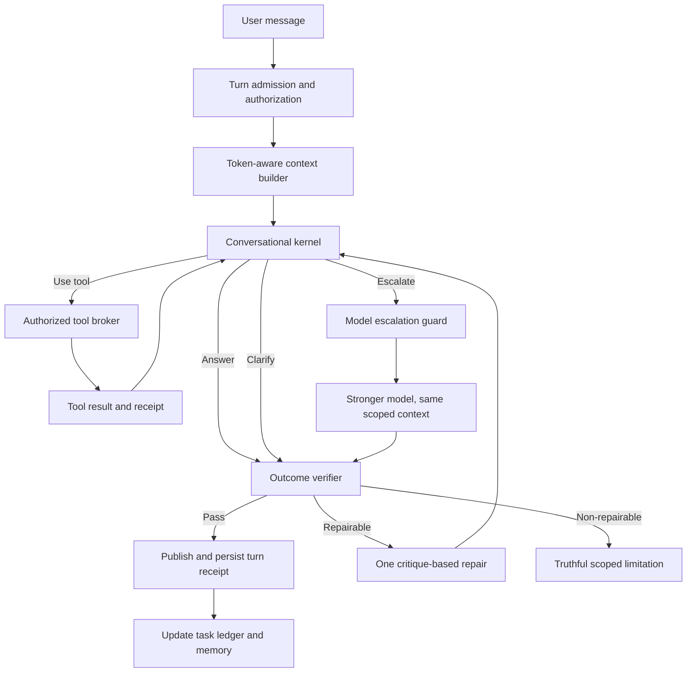

# NEXX Conversational Kernel Phase 2 Hardening Specification

**Status:** Implementation-ready  
**Priority:** P0 conversational reliability; P0 evidence and authorization integrity; P1 cost and maintainability  
**Production baseline:** `63b4c9c4e3cd3e2cd797271325a5e177adaef7b1`  
**Target outcome:** ChatGPT-class conversational handling with Nexproof-specific legal, document, safety, and cost controls  
**Extends:** Plans 14–17  
**Supersedes:** Any remaining use of `RouteMode` as foreground semantic authority

## 1. Executive decision

Phase 1 fixed the reported mediation follow-up failure, stopped stale document state from hijacking ordinary questions, preserved natural provider prose on conversational routes, introduced GPT-5.6 model tiers, and added actual token and cost telemetry.

Phase 2 will finish the architectural transition from a route-first workflow engine to a conversation-first agent with controlled tools.

The key change is:

```text
Before
  classify into a mode
  -> inherit route/document state
  -> constrain model and response format
  -> possibly rewrite the answer

Phase 2
  understand the latest turn in recent conversational context
  -> answer, clarify, use an authorized tool, resume a task, or escalate
  -> validate evidence, permissions, side effects, and cost
  -> publish the model's valid natural answer
```

The model will lead semantic interpretation. Deterministic application code will continue to control authorization, evidence boundaries, tool execution, side effects, safety escalation, budgets, persistence, and publication integrity.

This is the architecture expected of a high-functioning conversational system: fluid dialogue in the foreground, structured capabilities and safeguards in the background.

## 2. Current verified baseline

### 2.1 Production state

The Phase 1 release is deployed to `https://nexproof.io` from production commit `63b4c9c`.

Verified behavior includes:

- natural handling of `What is mediation?` followed by `What does it look like?`;
- no activation of historical document work during that exchange;
- natural greetings and topic changes;
- contextual numeric follow-ups;
- correct clarification for an unknown term;
- explicit upload-wait behavior;
- successful execution of an accepted document-review recommendation;
- no production hard-stop codes;
- actual GPT-5.6 Luna token and cost capture.

### 2.2 Remaining architecture debt

The current system is safer, but it remains transitional:

- `src/app/api/chat/route.ts` still selects and persists `routeMode`;
- `convex/chatTurns.ts` still derives active and final route modes;
- `convex/chatWorker.ts` is approximately 4,800 lines and uses `routeMode` throughout prompt construction, document selection, response formatting, verification, repair, and fallback;
- `src/lib/nexx/responseLifecycle.ts` still selects reasoning, output budgets, renderers, enrichment, and verification by route;
- document access is still partly inferred before generation instead of being requested through a single tool boundary;
- model selection is improved but remains route- and tier-shaped rather than receipt-driven;
- the target conversation kernel, task ledger, tool broker, and outcome verifier modules do not yet exist as independent boundaries;
- production health is based on a rolling aggregate window and does not cleanly separate current-release behavior from legacy attempts;
- several valid reliability mechanisms are interleaved in the worker, making changes difficult to reason about and test independently.

### 2.3 Constraints that must remain intact

Phase 2 must preserve:

- Clerk identity and tenant authorization;
- Convex as the durable application source of truth;
- QA and production namespace isolation;
- document authorization and evidence provenance;
- resumable upload and durable review behavior;
- publication envelopes and release compatibility checks;
- current signed-in browser assurance;
- production canaries and hard-stop behavior;
- streaming recovery and idempotent assistant persistence;
- user-visible safety and emergency handling;
- the ability to roll back without losing conversation, task, or document state.

## 3. Goals and non-goals

### 3.1 Goals

1. Make direct natural conversation the default behavior.
2. Resolve ordinary follow-ups from recent dialogue rather than from stored route state.
3. Allow effortless topic interruption and later task resumption.
4. Give the model explicit, authorized tools for document access, research, drafting, and task actions.
5. Keep documents available as resources without silently making them the current topic.
6. Make model escalation invisible, bounded, evidence-based, and cost-aware.
7. Preserve valid provider prose unless a concrete evidence, safety, or authorization rule fails.
8. Support receipt-backed correction when a user challenges an answer.
9. Record a complete operational receipt for every turn and provider attempt.
10. Make conversational quality measurable through a frozen, replayable evaluation corpus.
11. Reduce the size and responsibility of the current chat worker.
12. Demonstrate material cost reduction without degrading critical legal or document behavior.

### 3.2 Non-goals

Phase 2 will not:

- make the model authoritative for permissions, tenant scope, or document access;
- store or expose chain-of-thought;
- allow unbounded autonomous side effects;
- rely exclusively on provider-hosted conversation state;
- remove deterministic validation from evidence-sensitive answers;
- use Sol for routine premium-tier traffic merely because a user has access to it;
- rewrite the document-processing, OCR, upload, or durable-review subsystems unless an interface change is required;
- attempt to imitate ChatGPT's visual design or private internal implementation;
- guarantee that every answer is correct; it will improve handling, grounding, correction, and failure transparency.

## 4. Product behavior contract

### 4.1 Foreground authority

The latest user message and the immediately preceding dialogue are the foreground authority.

Historical summaries, route labels, documents, cases, and tasks may inform the model but may not redefine the latest user goal. A background document review remains a resource and task, not an instruction to discuss that document on every turn.

### 4.2 Direct answer is the default

If the user can be answered from general knowledge and recent conversation, the assistant answers directly without retrieval, a preliminary classifier, or a structured legal response shell.

Examples:

- `What is mediation?`
- `What does it look like?`
- `Can you explain that more simply?`
- `What is 9 + 6?`
- `Thanks`

### 4.3 Natural topic changes

Users do not need a mode command. A new topic becomes foreground when the current message and recent dialogue support it.

Changing topics suspends—not deletes—unfinished background work. The user can later say `let's return to the order review` or refer naturally to the prior task.

### 4.4 Referent resolution

Pronouns such as `it`, `that`, `this`, and `they` resolve against recent explicit conversational referents first.

A weak pronoun alone may not activate a stored document. If two plausible recent referents would materially change the response, the assistant asks one focused clarification.

### 4.5 Clarification policy

Clarification is appropriate only when ambiguity materially changes:

- the answer;
- the evidence scope;
- the selected document;
- a deadline or jurisdiction;
- a material side effect;
- user safety.

The assistant must not ask for clarification merely because a regex, route, or background task is uncertain.

### 4.6 Document behavior

The assistant accesses a document only when at least one of these is true:

- the user explicitly references the document or attachment;
- the immediate dialogue contains an unambiguous document referent;
- the user resumes a specific document task;
- an authorized tool plan requires the document and the model identifies why it is relevant.

The assistant must not claim to have reviewed a document unless a successful tool receipt identifies the exact authorized document content used.

### 4.7 Corrections

When a user says `that's wrong`, contradicts a prior answer, or supplies corrective facts, the assistant may inspect the prior turn receipt and then:

- acknowledge and correct;
- retrieve missing evidence;
- explain why the original answer remains supported;
- ask one material clarification;
- escalate once to a stronger model.

The assistant must not defensively repeat the same answer without inspecting available evidence and receipts.

### 4.8 Failure behavior

A failure message must describe the real limitation of the current turn.

Allowed examples:

- the selected file is still processing;
- the requested document is not authorized for this conversation;
- a research provider is temporarily unavailable;
- a deadline cannot be calculated without a jurisdiction or service date.

Disallowed behavior:

- substituting a generic order-language limitation for an ordinary question;
- claiming a file is unreadable without an inspection receipt;
- claiming research was performed without a tool receipt;
- implying an action was scheduled when it was not persisted;
- silently replacing a valid answer with a route-specific canned response.

## 5. Design principles

1. **Conversation first:** meaning comes from the latest turn and recent dialogue.
2. **Capabilities, not modes:** documents and services are tools the agent may use, not sticky conversational identities.
3. **Least-privilege context:** give the model only the relevant authorized context needed for the current turn.
4. **Model proposes; application disposes:** the model proposes cognitive actions; code validates and executes them.
5. **Natural prose is model-owned:** deterministic rendering is reserved for explicit structured artifacts.
6. **Evidence follows claims:** grounded claims must point to evidence actually retrieved during the turn.
7. **Tasks are resumable:** background work is durable without hijacking foreground conversation.
8. **Escalation is earned:** stronger models require recorded need, budget, and eligibility.
9. **Repair is bounded:** at most one ordinary repair and one justified model escalation.
10. **Every outcome is observable:** decisions, tools, evidence, usage, latency, and cost are recorded without hidden reasoning.
11. **Compatibility is additive:** schema and runtime changes deploy safely across mixed web/Convex versions.
12. **Rollback never restores known semantic defects:** model rollback and kernel rollback are independent.

## 6. Target architecture



### 6.1 Responsibility boundaries

| Component | Owns | Must not own |
|---|---|---|
| Turn admission | identity, tenant, quota, idempotency, current attachment authorization | conversational meaning |
| Context builder | recent messages, summaries, tasks, resource descriptors, token budget | choosing an answer |
| Conversational kernel | answer/tool/clarify/escalate proposal | authorization or persistence |
| Tool broker | validation, execution, timeouts, evidence receipts | changing the user's topic |
| Model policy | allowed model, effort, budget, escalation | interpreting document references |
| Outcome verifier | goal relevance, evidence integrity, prohibited claims | route-format compliance |
| Publication layer | atomic save, stream state, envelope, deduplication | rewriting valid prose |
| Task ledger | durable background work and pending decisions | sticky foreground mode |
| Memory service | compact older context and stable preferences | silently activating resources |

## 7. Core runtime contracts

### 7.1 Turn context

```ts
type ConversationTurnContext = {
  turnId: Id<'chatTurns'>;
  conversationId: Id<'conversations'>;
  userId: Id<'users'>;
  tenantId: string;
  message: string;
  recentMessages: Array<{
    id: string;
    role: 'user' | 'assistant';
    content: string;
    createdAt: number;
  }>;
  summary?: {
    text: string;
    sourceThroughMessageId: string;
    version: number;
  };
  immediateReferents: ReferentBinding[];
  tasks: BackgroundTaskDescriptor[];
  pendingDecision?: PendingDecisionDescriptor;
  resources: AuthorizedResourceDescriptor[];
  availableTools: AuthorizedToolDescriptor[];
  budget: TurnBudget;
  rollout: TurnRolloutSnapshot;
};
```

The context contains descriptors, not complete document bodies. Document text enters the model context only through an authorized tool result.

### 7.2 Kernel decision

```ts
type KernelDecision =
  | { kind: 'answer'; answer: string }
  | { kind: 'clarify'; question: string; ambiguity: AmbiguityReceipt }
  | { kind: 'tool_call'; calls: ProposedToolCall[] }
  | { kind: 'escalate'; request: EscalationRequest }
  | { kind: 'limited'; message: string; limitation: LimitationReceipt };
```

The decision schema is not the user-facing response schema. Plain answers remain plain text.

### 7.3 Background task

```ts
type BackgroundTask = {
  taskId: string;
  conversationId: string;
  goal: string;
  status:
    | 'open'
    | 'waiting_user'
    | 'waiting_tool'
    | 'suspended'
    | 'completed'
    | 'cancelled';
  resourceIds: string[];
  pendingDecisionId?: string;
  checkpoint?: TaskCheckpoint;
  createdAt: number;
  lastTouchedAt: number;
  expiresAt?: number;
};
```

Task status never automatically becomes the foreground user goal. Resumption requires current conversational support.

### 7.4 Turn receipt

```ts
type TurnReceipt = {
  turnId: string;
  outcome:
    | 'answered'
    | 'clarified'
    | 'tool_used'
    | 'escalated'
    | 'limited'
    | 'failed';
  foregroundGoal: string;
  resolvedReferents: ReferentBinding[];
  modelAttempts: ModelAttemptReceipt[];
  toolCalls: ToolCallReceipt[];
  evidenceIds: string[];
  taskTransitions: TaskTransitionReceipt[];
  validation: OutcomeValidationReceipt;
  publicationId?: string;
  rolloutConfigVersion: number;
  createdAt: number;
};
```

The receipt stores decisions and facts, never hidden chain-of-thought.

### 7.5 Model attempt receipt

Each provider attempt records:

- model and provider;
- reasoning effort and verbosity;
- request start, first-token, and completion times;
- termination reason;
- retry and continuation relationship;
- input, cached input, output, reasoning, and total tokens;
- pricing-table version;
- estimated cost in micro-USD;
- provider response ID;
- tool-call count;
- success, retryable failure, or terminal failure code;
- whether usage was provider-reported, estimated, or unavailable.

## 8. Context builder

### 8.1 Context layers

Build context in this order:

1. concise system safety, evidence, and collaboration policy;
2. current user message;
3. most recent 8–12 relevant messages, limited by token budget;
4. compact older-conversation summary;
5. active pending decision when directly relevant;
6. compact background-task descriptors;
7. authorized resource descriptors;
8. current-turn attachments;
9. dynamically authorized tool definitions.

### 8.2 Selection rules

- Preserve the latest user and assistant exchange verbatim.
- Prefer recency and direct lexical/semantic connection over stored route labels.
- Exclude deleted, revoked, quarantined, superseded, and cross-tenant resources.
- Do not include full document contents preemptively.
- Do not include inactive task options unless the current turn may accept or resume them.
- Summaries must identify their source boundary and may not supersede newer messages.
- When context must be truncated, record what category was omitted.

### 8.3 Token budgets

Initial input allocation:

| Context category | Target allocation |
|---|---:|
| System and developer policy | 10% |
| Current turn and recent messages | 40% |
| Retrieved tool evidence | 35% |
| Summary, tasks, and resource descriptors | 15% |

These are adaptive targets, not hard partitions. Retrieved evidence may expand for document work, but ordinary conversation must not carry document bodies.

### 8.4 Context safety tests

Tests must prove:

- revoking a document removes it from the next turn;
- deleting a message prevents it from reappearing via summary;
- cross-tenant resources never enter descriptors or tools;
- QA resources never enter production context;
- an old summary cannot override a newer correction;
- a background task remains resumable after context compaction.

## 9. Task ledger and conversational state

### 9.1 State layers

Maintain four separate layers:

1. **Immediate dialogue:** recent messages and referents.
2. **Foreground goal:** what the user is asking now.
3. **Background tasks:** resumable unfinished work.
4. **Resource inventory:** authorized documents, case facts, and tools.

No layer may be collapsed into a single `activeMode` field.

### 9.2 Task transitions

Allowed transitions are validated by code:

```text
open -> waiting_user | waiting_tool | suspended | completed | cancelled
waiting_user -> open | suspended | cancelled
waiting_tool -> open | suspended | completed | cancelled
suspended -> open | cancelled
completed -> open only through explicit restart
cancelled -> no automatic transition
```

### 9.3 Pending decisions

A pending decision contains stable option IDs, the task revision that created it, eligible actions, expiry, and whether explicit confirmation is required.

An acceptance such as `please do so` may execute only if:

- exactly one current recommendation is eligible;
- the task and option revisions still match;
- the relevant resource authorization is unchanged;
- the action remains within the user's tier and budget;
- quoted or historical text is not mistaken for current acceptance.

### 9.4 Compatibility

Existing `conversation.routeMode`, focused legal issue, and execution-plan records remain readable during migration. They are copied into diagnostic/shadow fields but stop defining foreground meaning once the new kernel is active.

## 10. Authorized tool broker

### 10.1 Initial tool inventory

The broker will expose only tools authorized for the current turn:

- `search_authorized_documents`
- `read_document_pages`
- `get_document_metadata`
- `compare_document_versions`
- `inspect_document_processing_status`
- `verify_current_law`
- `lookup_local_procedure`
- `create_draft_artifact`
- `save_task_checkpoint`
- `inspect_prior_turn_receipt`
- `resume_background_task`
- `request_expert_escalation`

### 10.2 Tool-call envelope

Every call includes:

```ts
type ToolCallEnvelope<TArgs> = {
  toolCallId: string;
  turnId: string;
  toolName: string;
  args: TArgs;
  authorizationScopeHash: string;
  idempotencyKey?: string;
  requestedByModel: string;
  createdAt: number;
};
```

### 10.3 Broker enforcement

The broker must:

- validate arguments with strict schemas;
- verify user, tenant, case, conversation, and document access;
- reject IDs not present in the turn's authorized resource inventory;
- separate read-only and side-effecting tools;
- require deterministic confirmation for material side effects;
- cap calls, bytes, pages, and execution time;
- return typed errors that the model can act upon;
- persist tool-call and tool-result receipts;
- deduplicate idempotent retries;
- redact secrets and internal error details from model-visible results.

### 10.4 Tool loop limits

Initial limits:

- maximum 4 tool calls for an ordinary turn;
- maximum 8 tool calls for a high-complexity document turn;
- maximum 2 sequential calls to the same read tool unless pagination advances;
- maximum 1 automatic repair generation;
- maximum 1 model escalation;
- no automatic retry of material side effects;
- provider and worker deadlines must reserve time for publication and recovery.

## 11. Conversational kernel

### 11.1 Kernel loop

The kernel performs:

1. load the authorized `ConversationTurnContext`;
2. select the lowest eligible model;
3. request an answer, clarification, tool call, or escalation;
4. validate proposed tool calls through the broker;
5. append successful tool results to the same logical turn;
6. continue using `previous_response_id` only within the turn when safe;
7. validate the final outcome;
8. repair once if the verifier returns actionable critique;
9. publish atomically or return a truthful limitation;
10. update receipts, tasks, and memory asynchronously.

### 11.2 Provider state

Convex remains the durable source of truth.

Use provider `previous_response_id` for:

- tool-result continuation within a turn;
- interrupted-stream continuation;
- a single verifier-guided repair.

Do not initially chain provider state across user turns. Cross-turn provider state may be enabled only after authorization revocation, message editing, deletion, retention, and context-replacement tests pass.

### 11.3 Streaming

- Stream natural text as soon as the response is safe to expose.
- Do not stream structured tool arguments to the user as answer text.
- Persist checkpoints for long responses and durable work.
- If a stream stops after usable text, attempt bounded continuation without repeating content.
- If publication validation requires the complete response, show a neutral working state rather than unverified prose.
- Save exactly one committed assistant message for a successful turn.

### 11.4 Concurrency and idempotency

- One active foreground generation lease per conversation by default.
- A duplicate client submission with the same idempotency key returns the existing turn.
- Background durable tasks may continue independently but cannot publish into the foreground without a valid task/turn link.
- A newer user turn may cancel or supersede an uncommitted direct-answer generation.
- Tool and publication receipts use stable IDs across retries.

## 12. Model policy and escalation

### 12.1 Portfolio

| Workload | Initial model | Typical effort |
|---|---|---|
| Greeting, acknowledgement, simple product help, narrow clarification, title, compaction | GPT-5.6 Luna | none or low |
| Quality-proven low-risk general conversation | GPT-5.6 Luna with Terra escalation available | low |
| Nuanced conversation, legal education, personalized support, ordinary tool orchestration | GPT-5.6 Terra | low or medium |
| Document-grounded conclusions, drafting, deadline/procedure questions | GPT-5.6 Terra | medium |
| Conflicting evidence, high-impact multi-document work, difficult correction | GPT-5.6 Sol after guard approval | medium or high |

The model portfolio is configuration, not conversational mode. A user's subscription controls access and budgets, not automatic model spending.

### 12.2 Deterministic minimum-model guard

The guard may force Terra or block Luna when the turn involves:

- personalized legal interpretation;
- document-grounded conclusions;
- jurisdiction-dependent procedure;
- deadline calculation;
- court-ready drafting;
- current safety risk;
- a challenged prior substantive answer;
- conflicting evidence;
- material side effects.

The guard may raise the minimum model but may not select the user's topic or activate a document.

### 12.3 Escalation request

```ts
type EscalationRequest = {
  fromModel: string;
  requestedModel: 'gpt-5.6-terra' | 'gpt-5.6-sol';
  reasonCode:
    | 'legal_risk'
    | 'conflicting_evidence'
    | 'deadline_uncertainty'
    | 'high_impact_draft'
    | 'validation_failure'
    | 'challenged_answer'
    | 'complexity_limit';
  evidenceIds: string[];
  remainingBudgetMicrousd: number;
};
```

### 12.4 Escalation limits

- Luna may escalate to Terra once.
- Terra may escalate to Sol once when a permitted reason exists.
- Sol must remain at or below 5% of completed turns absent an approved exception.
- An escalation may not restart completed tool work unnecessarily.
- The stronger model receives the same scoped context, evidence, and receipts.
- If the budget is insufficient, return a useful bounded answer or explain what additional analysis would require.

### 12.5 Output budgets

Initial ceilings:

| Turn class | Maximum output tokens |
|---|---:|
| Social or simple answer | 800 |
| Ordinary conversation | 2,000 |
| Nuanced legal guidance | 4,000 |
| Tool-grounded answer | 6,000 |
| Document review or court-ready draft | 8,000 |
| Exceptional approved artifact | 12,000 |

Budgets are ceilings, not targets. The model should match the user's requested depth.

## 13. Prompt architecture

### 13.1 System policy

Keep the system prompt short and stable. It should define:

- Nexproof's role and limitations;
- conversation-first behavior;
- authorization and evidence integrity;
- safety escalation;
- truthful tool and capability claims;
- no exposure of hidden reasoning;
- direct answers by default;
- current-message priority over historical task state.

### 13.2 Developer policy

The developer prompt should describe collaboration and outcomes, not a large route-specific workflow. Dynamic instructions should be added only when a tool or structured artifact is actually in use.

### 13.3 Tool instructions

Tool definitions carry their own usage conditions, arguments, and failure semantics. Do not repeat full tool instructions in the general prompt.

### 13.4 Prompt caching

- Keep stable policy at the beginning of the request.
- Version cache keys deliberately.
- Place variable conversation and evidence after stable policy.
- Measure cached-input ratio per model and workload.
- Invalidate caching when safety, evidence, or tool policy changes.

## 14. Outcome verification and publication

### 14.1 Verification dimensions

The verifier evaluates:

1. **Responsiveness:** does the answer address the latest user goal?
2. **Continuity:** does it resolve follow-ups from recent dialogue correctly?
3. **Evidence integrity:** are document/legal claims supported by receipts?
4. **Capability truthfulness:** did claimed tools/actions actually run?
5. **Authorization:** were all resources and actions allowed?
6. **Safety:** were applicable safety requirements followed?
7. **Interaction integrity:** was clarification or confirmation necessary and correctly handled?
8. **Fallback quality:** is any limitation specific and true?

### 14.2 Verification strategy

- Use deterministic checks for authorization, evidence IDs, tool receipts, side effects, and known prohibited fallback phrases.
- Use lightweight semantic evaluation only when deterministic checks cannot assess latest-goal relevance.
- Never allow the candidate answer to certify its own correctness.
- Do not require route-specific sections for ordinary prose.
- Do not rewrite a valid response for tone or formatting alone.

### 14.3 Repair

If repairable, return concise machine-readable critique to the same model:

```ts
type RepairCritique = {
  codes: Array<
    | 'latest_goal_not_answered'
    | 'unsupported_document_claim'
    | 'false_tool_claim'
    | 'irrelevant_historical_context'
    | 'unnecessary_refusal'
    | 'missing_material_clarification'
  >;
  evidenceIds: string[];
  instruction: string;
};
```

Only one standard repair is allowed. A second failure may trigger one justified escalation or a truthful limitation.

### 14.4 Publication

Publication must be atomic and include:

- assistant message;
- completion status;
- outcome validation receipt;
- evidence links;
- task transitions;
- provider attempt references;
- rollout/version fields;
- degradation or limitation code when applicable.

## 15. Data and schema changes

Use additive Convex schema changes first.

### 15.1 New tables or equivalent additive records

- `conversationTasks`
- `conversationTaskCheckpoints`
- `turnReceipts`
- `toolCallReceipts`
- `modelEscalationReceipts`
- `conversationReferentBindings`
- `conversationKernelEvaluations`
- `chatCostBudgets`

### 15.2 Existing tables

Extend existing turn/generation records with:

- kernel version;
- context-builder version;
- tool-policy version;
- model-policy version;
- pricing version;
- foreground-goal summary;
- outcome type;
- usage provenance;
- release Git SHA;
- production/preview/QA namespace;
- shadow-versus-published marker.

### 15.3 Migration rules

- No destructive schema migration during rollout.
- Old records remain readable.
- New code tolerates missing new fields.
- Backfills operate in bounded pages and are resumable.
- Existing `routeMode` data remains available for comparison but is not copied into foreground-goal fields without conversational evidence.
- Index creation must precede code that requires the index.
- Web and Convex release manifests must declare compatible minimum peer versions.

## 16. Cost controls

### 16.1 Cost accounting

Track cost by:

- successful versus failed outcome;
- direct answer, clarification, tool use, repair, and escalation;
- model;
- user tier;
- feature and artifact type;
- input, cached input, output, and reasoning tokens;
- tool and retrieval usage;
- release and rollout cohort.

### 16.2 Budget hierarchy

Budgets apply in this order:

1. provider-attempt ceiling;
2. turn ceiling;
3. daily user/tier ceiling;
4. feature ceiling;
5. system-wide emergency ceiling.

Safety responses and truthful failure messages must remain available when a premium analysis budget is exhausted.

### 16.3 Initial objectives

- At least 99% of post-release provider attempts have actual usage or an explicit `usage_unavailable` reason.
- Average cost per successful ordinary turn is at least 50% below the frozen GPT-5.4 baseline.
- Repairs remain below 2% of completed turns.
- Sol remains at or below 5% of completed turns.
- Failed attempts and unnecessary retrieval are reported separately from successful cost.
- Prompt caching effectiveness is visible by model and workload.

## 17. Observability and operational controls

### 17.1 Required metrics

- direct-answer rate;
- clarification rate and resolution rate;
- topic-switch success;
- background-task resume success;
- document activation precision and false-positive rate;
- unauthorized-resource rejection count;
- tool calls per successful turn;
- unnecessary tool-use rate;
- outcome validation failure and repair rate;
- generic/known-fallback publication count;
- model distribution and escalation reasons;
- usage completeness and cost per successful outcome;
- time to first token and total completion latency;
- stream interruption and recovery rates;
- task and publication idempotency violations;
- QA/production isolation violations;
- metrics by release Git SHA and rollout cohort.

### 17.2 Release-cohort health

Health reports must distinguish:

- current release/cohort;
- earlier releases in the rolling window;
- synthetic QA turns;
- real production turns;
- legacy attempts without actual usage;
- post-migration attempts with full receipts.

A new release must not appear unhealthy solely because old attempts remain in a 24-hour aggregate. The dashboard should show both cohort health and rolling operational health.

### 17.3 Hard stops

Automatically stop or roll back a cohort when any of these occurs:

- unauthorized or cross-tenant evidence use;
- QA data entering production user context;
- false claim that a tool or action ran;
- zero-document analysis publication;
- known canned fallback published for an unrelated question;
- material side effect without required confirmation;
- release manifest incompatibility;
- repeated semantic canary failure;
- publication without a valid envelope;
- task or message duplication caused by retry.

### 17.4 Soft stops

Pause cohort advancement for:

- unexplained fallback rate above 1%;
- unnecessary tool-use rate above 2%;
- repair exhaustion above 0.5%;
- Luna under-escalation in a critical evaluation;
- Sol usage above 5%;
- p95 latency more than 20% worse than the approved baseline;
- successful-turn cost above the approved budget;
- actual-usage completeness below 99%;
- semantic canary staleness.

### 17.5 Alerts and runbooks

- Every hard stop opens or updates one deduplicated operational alert.
- Alerts include release SHA, cohort, failure code, affected boundary, rollback recommendation, and sanitized evidence.
- Successful recovery closes or resolves the alert through an explicit runbook step.
- Production application errors should flow to a retained centralized log or error-tracking destination; absence of Vercel log entries alone is not sufficient observability.

## 18. Test and evaluation specification

### 18.1 Deterministic unit and contract tests

Cover:

- context selection and token truncation;
- task state transitions;
- referent precedence;
- tool authorization and argument validation;
- idempotency and duplicate publication;
- model eligibility and escalation budgets;
- usage and price calculation;
- evidence-receipt validation;
- repair ceilings;
- release/config compatibility;
- QA and tenant isolation;
- legacy record compatibility.

### 18.2 Frozen incident corpus

Include every known production failure, especially:

- `What is mediation?` -> `What does it look like?`;
- greeting after document work;
- promised future upload with historical files present;
- terse recommendation acceptance;
- unknown shorthand during an active task;
- concise math followed by a contextual calculation;
- false unreadable-file claims;
- completed analysis replaced by a generic limitation;
- a new topic while a durable review remains open;
- resuming the durable review after several unrelated turns.

### 18.3 Conversational transition corpus

Create at least 200 adjudicated multi-turn cases across:

- direct answer -> follow-up;
- answer -> simplify;
- answer -> correction;
- topic A -> topic B -> resume A;
- document task -> social turn -> general question -> resume document;
- ambiguous referent with one plausible target;
- ambiguous referent with multiple material targets;
- user changes jurisdiction or key facts;
- assistant asks a clarification and uses the answer;
- user declines or modifies a recommendation;
- user quotes earlier text without accepting it;
- long conversations with summary compaction;
- simultaneous current attachment and historical stored documents.

### 18.4 Tool and evidence corpus

Cover:

- explicit document lookup;
- exact-page request;
- document comparison;
- missing or processing document;
- revoked document between turns;
- cross-tenant document ID injection;
- prompt injection inside a document;
- conflicting clauses;
- superseded document versions;
- current-law verification success and provider failure;
- local-procedure lookup requiring jurisdiction;
- draft creation with and without required confirmation;
- tool timeout, retry, pagination, and partial results.

### 18.5 Model-policy evaluation

For each case, run the cheapest eligible model and compare against Terra. Evaluate:

- latest-goal relevance;
- factual and legal correctness;
- evidence support;
- appropriate clarification;
- unwanted tool use;
- under-escalation and over-escalation;
- tone and usefulness;
- latency and cost.

Critical cases require deterministic acceptance criteria plus human adjudication before Luna eligibility expands.

### 18.6 Required quality thresholds

- Latest-turn relevance: at least 99% overall and 100% on the frozen incident corpus.
- Natural follow-up resolution: at least 98%.
- Unwanted document activation: below 0.5%.
- Unauthorized evidence use: zero.
- False tool/action claims: zero.
- Known canned fallback publication: zero.
- Background-task resume success: at least 98%.
- Critical correction success after one repair/escalation: at least 95%.
- No critical-slice regression relative to the Terra baseline.

### 18.7 Browser and production assurance

The signed-in browser matrix must verify the complete path:

```text
composer
-> chat API
-> turn admission
-> context builder
-> kernel/model
-> optional tool broker
-> Convex persistence
-> publication
-> rendered assistant response
```

Run:

- deterministic tests on every PR;
- isolated provider-in-loop tests in preview;
- signed-in browser tests on every preview deployment;
- release assurance against the production URL;
- isolated semantic canaries on schedule;
- the full adjudicated corpus nightly or before cohort advancement;
- a weekly fault-injection suite for tool, provider, stream, and durable-task failures.

## 19. Security and privacy

### 19.1 Authorization invariants

- All resource IDs come from server-built authorized inventories.
- Model-proposed IDs are untrusted until broker validation.
- Tool output is scoped to the requesting turn and user.
- Tenant and QA namespace are persisted on receipts.
- Authorization is rechecked after long-running work and before publication.

### 19.2 Prompt-injection resistance

- Uploaded content is data, never system instruction.
- Tool output is marked with provenance and trust level.
- Document text cannot add tools, change authorization, request secrets, or alter system policy.
- The broker ignores instructions embedded in tool results.
- Evaluation includes direct, indirect, and cross-document prompt-injection cases.

### 19.3 Data retention

- Retain only the receipts required for reliability, audit, and billing.
- Do not store hidden reasoning.
- Redact secrets and sensitive provider errors.
- Support deletion and revocation across summaries, cached descriptors, tasks, and provider-state references.

## 20. File-level implementation map

### 20.1 Add

- `src/lib/nexx/conversation/contracts.ts`
- `src/lib/nexx/conversation/contextBuilder.ts`
- `src/lib/nexx/conversation/kernel.ts`
- `src/lib/nexx/conversation/taskLedger.ts`
- `src/lib/nexx/conversation/referentResolver.ts`
- `src/lib/nexx/conversation/turnReceipt.ts`
- `src/lib/nexx/conversation/modelPolicy.ts`
- `src/lib/nexx/conversation/budgetPolicy.ts`
- `src/lib/nexx/tools/contracts.ts`
- `src/lib/nexx/tools/toolBroker.ts`
- `src/lib/nexx/tools/documentTools.ts`
- `src/lib/nexx/tools/researchTools.ts`
- `src/lib/nexx/tools/taskTools.ts`
- `src/lib/nexx/tools/escalationTool.ts`
- `src/lib/nexx/response/outcomeVerifier.ts`
- `src/lib/nexx/response/repairCritique.ts`
- `src/lib/nexx/cost/modelPricing.ts`
- `src/lib/nexx/eval/cases.ts`
- `src/lib/nexx/eval/runner.ts`
- `src/lib/nexx/eval/adjudication.ts`
- corresponding focused test files for every module.

### 20.2 Modify

- `src/app/api/chat/route.ts` — admit and authorize turns; stop selecting foreground meaning.
- `convex/chatTurns.ts` — persist task, receipt, referent, tool, and rollout state.
- `convex/chatWorker.ts` — become a thin orchestration entry point delegating to modules.
- `convex/schema.ts` — add task, receipt, tool, escalation, and evaluation records.
- `src/lib/tiers.ts` — expose product budgets and minimum-model eligibility instead of route-owned model selection.
- `src/lib/nexx/prompts/systemPrompt.ts` — concise stable policy.
- `src/lib/nexx/prompts/developerPrompt.ts` — outcome-oriented collaboration policy.
- `src/lib/nexx/providerInput.ts` — consume the token-aware context package.
- `src/lib/nexx/provider/usageAccounting.ts` — use versioned pricing and usage provenance.
- `src/lib/nexx/response/publicationContract.ts` — validate outcome/evidence receipts.
- `src/lib/nexx/response/claimVerifier.ts` — consume tool receipts and latest-goal checks.
- `src/lib/nexx/response/selfCorrection.ts` — inspect turn receipts and use bounded repair.
- `convex/chatQualityCanary.ts` — add conversation-first and model-economy sequences.
- `convex/executiveChatOperations.ts` — release/cohort health and cost segmentation.
- production and preview release workflows — enforce the new gates.

### 20.3 Demote and later remove

- `src/lib/nexx/router.ts` — shadow analytics only.
- `src/lib/nexx/documentReferenceDetection.ts` — explicit hint extraction only.
- `src/lib/nexx/orchestration/turnUnderstanding.ts` — comparison telemetry only.
- `src/lib/nexx/orchestration/focusTransition.ts` — replaced by task/referent updates.
- `src/lib/nexx/orchestration/documentActivation.ts` — replaced by brokered tools.
- `src/lib/nexx/orchestration/executionPlan.ts` — replaced by kernel and tool receipts.
- `src/lib/nexx/responseLifecycle.ts` — replaced by outcome, model, and budget policies.
- `conversation.routeMode` reads — compatibility only, then remove after retention and rollback windows close.

## 21. Delivery sequence

Each PR must be independently deployable and additive until the route-authority removal stage.

### PR 1 — Operational cleanup and release-cohort truth

- close or supersede stale production alerts;
- make health metrics release/cohort-aware;
- distinguish legacy usage gaps from current attempts;
- add actual-usage completeness and cost-per-outcome alarms;
- update deprecated CI actions and stabilize cache behavior;
- publish a consolidated implementation status document.

**Gate:** current-release health is independently visible; zero behavior change.

### PR 2 — Contracts and additive schema

- add kernel, task, tool, receipt, budget, and escalation types;
- add schema tables/fields and indexes;
- add compatibility readers and versioned release contract;
- add idempotency and authorization contract tests.

**Gate:** mixed old/new runtime compatibility passes; no published behavior change.

### PR 3 — Context builder and task ledger in shadow

- build token-aware context packages;
- derive foreground goal, referents, background tasks, and resources separately;
- compare against legacy route/focus decisions;
- record divergence without changing published responses.

**Gate:** 99% latest-goal relevance on the adjudicated corpus; zero unauthorized context.

### PR 4 — Direct-answer kernel in shadow

- implement answer/clarify decisions without document tools;
- run Luna/Terra candidates beside production behavior;
- measure relevance, clarification, latency, and cost;
- store candidate outcomes only in isolated evaluation records.

**Gate:** frozen incidents pass; candidate is non-inferior to the production path.

### PR 5 — Authorized document and research tool broker

- add read-only document and research tools;
- enforce scope hashes and receipts;
- remove preemptive document bodies from ordinary context;
- validate zero-document and cross-tenant invariants.

**Gate:** zero unauthorized evidence; false document activation below 0.5%; unnecessary tool use below 2%.

### PR 6 — Outcome verifier, correction, and publication

- validate latest goal and evidence receipts;
- add one critique-based repair;
- enable receipt-backed correction;
- remove remaining ordinary-prose renderer replacement;
- retain deterministic structured artifact rendering.

**Gate:** zero known canned fallbacks; repair exhaustion below 0.5%; no false capability claims.

### PR 7 — Model escalation and cost budgets

- enable guarded Luna -> Terra -> Sol escalation;
- persist reason and budget receipts;
- add per-turn and daily budget enforcement;
- compare cost and quality against the Terra and GPT-5.4 baselines.

**Gate:** no critical under-escalation; Sol at or below 5%; successful-turn cost target met.

### PR 8 — Remove route semantic authority and modularize worker

- stop route selection in the API from controlling generation;
- stop reading stored route mode as foreground context;
- delegate worker responsibilities to the new modules;
- retain route labels only for shadow analytics;
- remove dead renderer and repair branches.

**Gate:** full unit, integration, provider, browser, fault-injection, and compatibility suites pass.

### PR 9 — Controlled production rollout and closeout

- run shadow and internal cohorts;
- advance through 5%, 25%, 50%, and 100%;
- perform flag-first rollback rehearsal;
- observe 100% production for seven stable days;
- remove expired compatibility code and archive superseded plans.

**Gate:** every definition-of-done criterion remains green for seven days.

## 22. Rollout controls

### 22.1 Server-controlled flags

Use versioned, approval-gated flags:

- `conversationKernelV2`
- `contextBuilderV2`
- `taskLedgerV2`
- `toolBrokerV2`
- `outcomeVerifierV2`
- `modelPolicyV2`
- `lunaUserFacing`
- `solEscalation`
- `routeModeAuthority`
- `actualUsageRequired`

Each turn records the exact resolved configuration. Client input cannot select or override rollout flags.

### 22.2 Cohorts

```text
off
-> shadow
-> internal allowlist
-> 5% for at least 24 hours
-> 25% for at least 48 hours
-> 50% for at least 72 hours
-> 100% for seven stable days
```

Advance only when all hard stops are clear and all soft thresholds are within bounds.

### 22.3 Rollback

- Disable the smallest responsible flag first.
- Preserve new schema data and receipts.
- A model-policy rollback must keep conversation-first semantics active.
- A kernel rollback must not restore the known canned fallback or weak-pronoun document activation.
- Roll back the web and Convex pair only to a declared compatible release.
- Re-run production assurance after rollback.

## 23. Repository and operational cleanup

Before PR 1:

- close resolved alert issue `#277` after linking the successful replacement release run;
- delete the merged remote Phase 1 branch;
- remove the clean Phase 1 worktree;
- refresh the dedicated local `main` worktree to current production without overwriting unrelated work;
- inventory historical worktrees and branches by PR state and unique diff before removal;
- regenerate and reconcile `convex/_generated/api.d.ts` from the current schema;
- normalize the line-ending-only `vitest.config.ts` status;
- consolidate plans 14–18 into a tracked status/index document while retaining useful incident evidence;
- update CI actions that still target deprecated Node runtimes;
- document where production application errors are retained and alerted.

Repository cleanup must be a separate, behavior-neutral change. Do not combine uncertain historical branch content with kernel implementation.

## 24. Risks and mitigations

| Risk | Mitigation |
|---|---|
| Model uses a tool unnecessarily | tool descriptions, call caps, evaluation threshold, broker rejection |
| Flexible semantics weaken legal grounding | minimum-model guard, evidence receipts, outcome verifier |
| Context builder omits an important task | background descriptors, resumable tasks, shadow comparison |
| Context leaks revoked or cross-tenant data | server-built inventory, authorization recheck, isolation tests |
| Luna under-handles nuance | critical exclusions, typed Terra escalation, non-inferiority evaluation |
| Sol costs grow | reason codes, tier/dollar guard, 5% ceiling, cost alarms |
| Schema/web mismatch during rollout | additive fields, version contract, paired release gate |
| Worker refactor breaks durable review | preserve subsystem interfaces, fault injection, incremental delegation |
| Semantic verifier creates a new bottleneck | deterministic-first checks, selective semantic evaluation, measure latency |
| Old aggregate data hides current release quality | release/cohort segmentation |
| Rollback reintroduces Phase 1 incident | independent flags and prohibited-regression suite |

## 25. Definition of done

Phase 2 is complete only when:

1. Ordinary questions and follow-ups are handled naturally without explicit mode switching.
2. Latest conversational referents outrank historical tasks and documents.
3. Background tasks suspend and resume without hijacking unrelated dialogue.
4. Documents enter model context only through current attachments or authorized tool results.
5. Zero-document document analysis is impossible.
6. `routeMode` has no foreground semantic or publication authority.
7. Valid natural provider prose cannot be overwritten by a route-specific fallback.
8. Clarifications occur only for material ambiguity.
9. Corrections use prior receipts and succeed without special challenge syntax.
10. Every tool call has authorization, execution, and result receipts.
11. Every grounded claim is traceable to evidence actually used.
12. Luna, Terra, and Sol transitions are bounded, recorded, and invisible to the user.
13. Sol remains rare and justified.
14. Actual usage and cost are available for at least 99% of current-release attempts or have explicit unavailability reasons.
15. Average successful-turn cost is at least 50% below the GPT-5.4 baseline without critical quality regression.
16. The frozen incident corpus passes at 100%.
17. The broader adjudicated corpus meets all quality thresholds.
18. Preview and production signed-in browser assurance pass.
19. No hard-stop event occurs during the full rollout.
20. Production remains inside hard and soft thresholds for seven days at 100%.
21. A rollback rehearsal succeeds without data loss or reactivation of known semantic defects.
22. The worker has been reduced to a thin orchestrator with independently tested modules.

## 26. Recommended first execution

Begin with PR 1 and PR 2 only.

PR 1 establishes trustworthy release-cohort observability and removes repository uncertainty. PR 2 creates the additive contracts and schema required by every later step. Neither should change user-visible chat behavior.

After those gates pass, implement the context builder and task ledger in shadow. Do not remove route authority or expand Luna traffic until the shadow evaluation proves that the new context and task model understand the latest user goal without weakening authorization or evidence integrity.

This sequencing keeps the current production fix stable while moving Nexproof toward a genuinely high-functioning conversational architecture through measurable, reversible steps.
